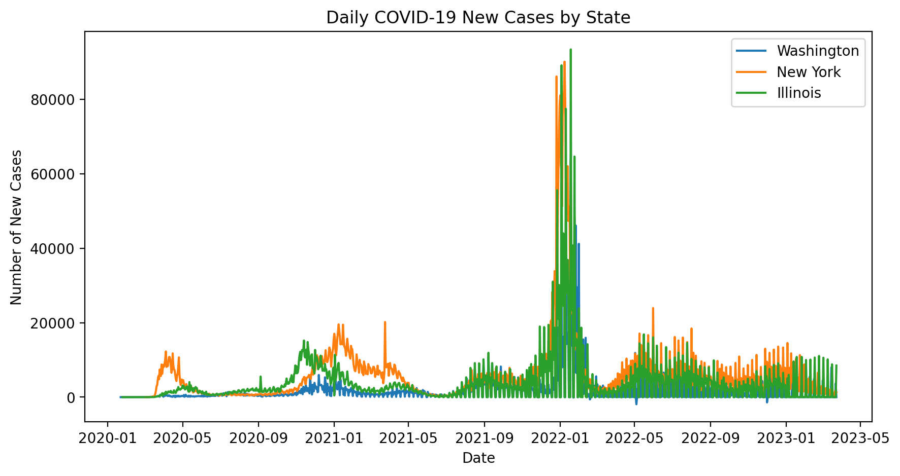
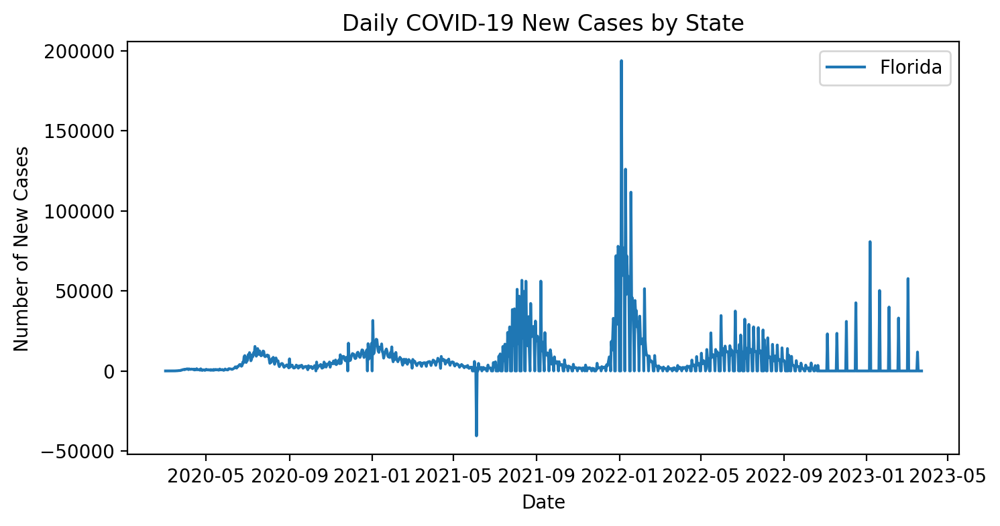
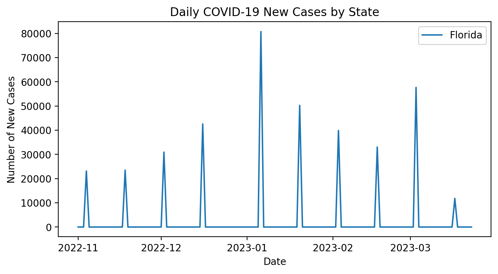
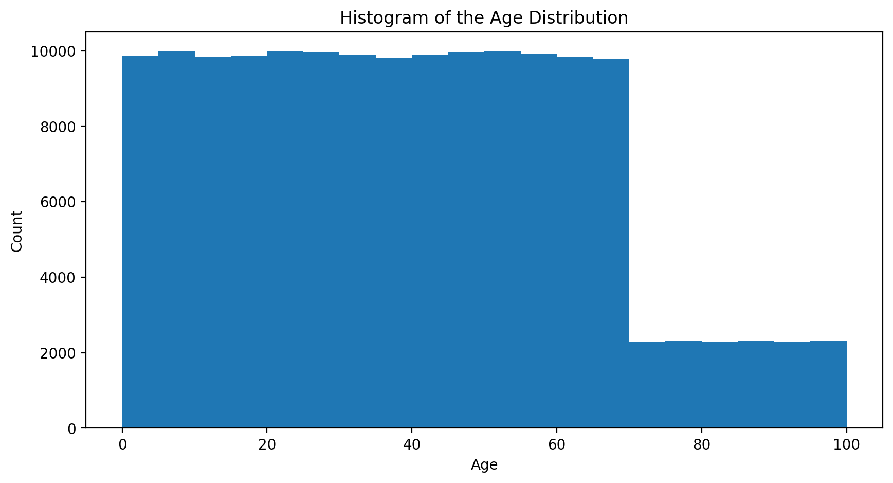
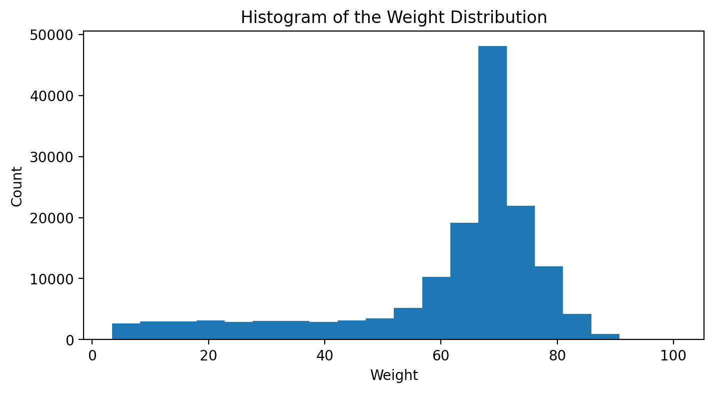
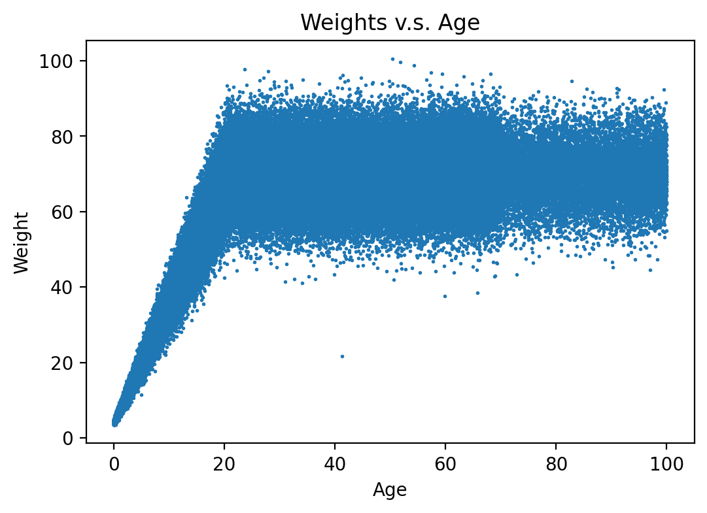

# Problem Set 0
**Name:** Yu (Irene) Wang

**NetID:** yw2247        
## Instructions to Run Code
- Python 3.x required  
- Install dependencies:  
  ```bash
  pip install pandas matplotlib sqlite3

### Exercise 1: Clinical Decision Support - Temperature Tester
**1a. Function Implementation**<br> 
(Code Appendix)

**1b. Identify ambiguity in problem description**<br> 
*Are there any aspects of 1a that could be interpreted in more than one way? Discuss.*<br>      
The problem does not define the units of temperature (i.e. Degrees F vs Degrees C). I assumed both the reference temperature and the tested values are in the same unit. Furthermore, the problem does not specify the type of input. I assumed only numerical values would be given. Also, "within 1 degree" is a bit ambiguious since it could be intepreted as either strictly less than 1 or less than or equal to 1. Here I chose the inclusive threshold (<=1). 

**1c. Testing**<br>
chicken_tester(42): True<br>
human_tester(42): False<br>
chicken_tester(43): False<br>
human_tester(35): False<br>
human_tester(98.6): False<br>

### Exercise 2:  Analyzing COVID-19 Case Data
**2a. Function Implementation**<br> 
(Code Appendix) 

**2b. Visualization of New Cases**<br> 
Below is the daily new cases plot (new cases versus date) for Washington, New York, and Illinois:



*Discuss any limitations of your approach.*<br>
The data comes from cumulative totals, so “daily new cases” are just the differences between days. This can create odd results if states revise their numbers (for example, negative values). Moreover, some states don’t report every day. They may report weekly or in batches, which can show up as long flat stretches at 0 and then large spikes. Lastly, the graph uses total counts, so bigger states naturally look larger than smaller ones. It doesn’t adjust for population size, so it's not good for comparisons between states. 

**2c. Find Peak Case Dates**<br> 
*Test this function and provide examples of its use.*<br>
I tested this function on 4 states. Below are their peak dates and peak new case counts:

Washington:  2022-01-18, 63640 new cases<br>
New York:    2022-01-08, 90132 new cases<br>
Illinois:    2022-01-18, 93423 new cases<br>
California:  2022-01-10, 227972 new cases<br>
We can see that most states peaked during early January 2022. Among the 4 tested states, California’s peak was especially high due to its large population. This shows the function correctly identifies the highest daily new case count for each state.

**2d. Compare Peak Cases**<br> 
*Test this function and provide examples of its use.*<br>
Example Results:<br>
| States Compared         | First to Peak     | Days Between Peaks |
| ----------------------- | ----------------- | ------------------ |
| Washington vs. New York | New York          | 10                 |
| Illinois vs. California | California        | 8                  |
| Washington vs. Illinois | Same Peak Date    | 0                  |
--------------------------------------------------------------------
New York’s peak occurred 10 days before Washington’s. California’s peak occurred 8 days before Illinois’s. Washington and Illinois peaked on the same day. These results show that most states reached their peaks around the same time, but there were small differences in timing between regions. The function is a straightforward way to compare peak dates. It gives a rough idea of how the outbreaks rose in different states.

**2e. Examine individual states**<br> 
*Review the data for Florida and identify any unusual patterns. Hypothesize about what might be happening.*<br>
Below is the daily new cases plot (new cases versus date) for Florida:



Two unusual patterns stand out:

1. Negative new case value

I hypothesize that this can appear when Florida revised its cumulative case count downward.

2. Jump patterns after Nov 2022 (Long stretches of zeros followed by sudden large increases)

The 25% percentile of daily new cases for Florida is 0, which supports this pattern.

The zoomed plot below makes this second pattern clearer:



I hypothesize that Florida stopped reporting daily during this period and instead updated case counts less frequently (e.g., weekly/biweekly/monthly). To test this, I measured the gaps between non-zero reporting days:

Count of gaps: 9<br>
Mean gap (days): 14.78<br>
Median gap (days): 14.0<br>
Top gap values: 14days (8 times), 21 days (1 time)

These results support the hypothesis: after November 2022, Florida reported new cases biweekly, with an occasional three-week gap.

### Exercise 3:  Analyzing Population Data
**3a. Load and Examine Data**<br> 
*What columns are present in the dataset?*<br>
There are 4 columns present in the dataset: "name", "age", "weight", and "eyecolor".

*How many rows (representing individuals) does the dataset contain?*<br>
The dataset contains 152361 rows. 

**3b. Analyze Age Distribution**<br>
*Compute and report the following statistics for the age column: mean, standard deviation, minimum, maximum.*<br>
mean: 39.510528<br>
std: 24.152760<br>
min: 0.000748<br>
max: 99.991547

*Plot a histogram of the age distribution with an appropriate number of bins.*<br>
Below is the histogram of the age distribution with number of bins = 20:<br>


*Describe the role of the number of bins.*<br>

The number of bins decides how the age range is split into intervals. For example, with ages from 0 to 100 and 20 bins, each bin represents 5 years (0–5, 5–10, …). More bins give more details but can look messy, while fewer bins look simpler but may hide details.

*Comment on any outliers or patterns you observe in the age distribution.*<br>

The age distribution looks fairly even up to around 70, with fewer individuals above 70. There are no impossible ages (e.g., below 0 or above 110), and no clear outliers.

**3c. Analyze Weight Distribution**<br>
*Compute and report the following statistics for the weight column: mean, standard deviation, minimum, maximum.*<br>
mean: 60.884134<br>
std: 18.411824<br>
min: 3.382084<br>
max: 100.435793

*Plot a histogram of the weight distribution with an appropriate number of bins.*<br>
Below is the histogram of the weight distribution with number of bins = 20:<br>


*Describe the role of the number of bins.*<br>
*I assumed the unit of weight is kg for the rest of the problem.*
The number of bins decides how the weight range is split into intervals. For example, if weights range from 0 to 100 (kg) and we use 20 bins, each bin covers 5 kg (0–5, 5–10, …).

*Comment on any outliers or patterns you observe in the weight distribution.*<br>
The weight distribution peaks around 65-75 kg and has a long left tail. Most individuals fall within the adult range. A few very low values (below 20 kg, minimum ~3.4 kg) are clear outliers, likely children or infants. Some high values near 100 kg are also rare but less extreme.

**3d. Explore Relationships**<br>
*Create a scatterplot of weights versus ages.*<br>


*Describe the general relationship between weights and ages as observed from the scatterplot.*<br>
Before about age 20, weight tends to increase with age, which shows a clear positive relationship because of growth and adolescence. After age 20, weights mostly stay between 50 and 100 kg, with differences between individuals but no clear trend of increasing or decreasing with age.

*Identify and name any individual whose data does not follow the general relationship observed.*<br>
Anthony Freeman. 

*Explain your process for identifying this outlier.*<br>
From the scatterplot, I noticed one point that did not follow the general relationship between age and weight: an individual older than 40 with a weight below 30 kg. To confirm, I filtered the dataset with the condition age > 40 and weight < 30, which returned this individual. Such a low weight for an adult is uncommon compared to the rest of the data, so this person is obviously an outlier.

### Exercise 4: Hospital Data Analysis
**4a. Data Loading and Basic Analysis**<br>
*Which gender is more common in PATIENTS.csv?*<br>
Female.

*How many entries are there for 'M' (Male) and 'F' (Female)?*<br>
There are 45 entries for 'M' (Male) and 55 entries for 'F' (Female).

**4b. Function Implementation**<br>
(Code Appendix)<br>

**4c. Function Testing**<br>
I've done tests on four diagnoses, which are summarized below.
1. Known diagnosis:
I tested get_subject_ids("Intestinal infection due to Clostridium difficile"). The result was:
- It returns a list (assert isinstance(result1, list)).
- All elements are integers (assert all(isinstance(x, int) for x in result1)).
- The list has no duplicates (assert len(result1) == len(set(result1))).
- Every returned ID exists in PATIENTS.subject_id (assert set(result1).issubset(patient_ids)).
These checks show the function returns valid, unique patient IDs that actually exist.

2. Cross-check with another diagnosis:
For "Down's syndrome", the function returned a single subject ID [42066], which matched what I found manually. This confirms the link between diagnosis titles, ICD-9 codes, and patient IDs is working as expected.

3. Empty-result cases:
For "Tuberculosis of ureter, unspecified" (no matches) and "nothing" (nonexistent title), the function returned empty lists. This shows it handles cases with no results safely.

Together, these tests cover:
- Positive cases (known diagnosis returns valid IDs),
- Negative cases (no matches and nonexistent titles return empty lists),
- Data quality checks (IDs are integers, unique, and found in PATIENTS).

They demonstrate that the function correctly maps a diagnosis title to ICD-9 codes and then to subject IDs. The function can also handle edge cases properly. 

**4d. Age Calculation**<br>
*Calculate the age in days at the time of death (dod-dob) for patients diagnosed with "Intestinal infection due to Clostridium difficile". Report your findings.*
There are 7 patients diagonsed with the syndrome. After dropping one row with unrealistic values (dob:1880-02-29, dod:2180-03-20; overflow due to de-identified shifted dates), I obtained results for 6 patients.<br>
The ages ranged from 21358 days (~58 years) to 29891 days (~82 years).<br>
The mean age at death was about 25699 days (~70 years).<br>
The distribution shows that these patients generally died between their late 50s and early 80s.<br> 
Below is the full information:

| subject id | gender | dob        | dod        | age at time of death (days)   |
|------------|--------|------------|------------|-------------------------------|
| 10043      | M      | 2109-04-07 | 2191-02-07 | 29891                         |
| 10045      | F      | 2061-03-25 | 2129-12-01 | 25087                         |
| 10102      | M      | 2035-04-13 | 2105-06-11 | 25626                         |
| 40595      | F      | 2068-03-04 | 2144-10-31 | 27999                         |
| 41976      | M      | 2136-07-28 | 2202-12-05 | 24235                         |
| 44228      | F      | 2112-10-22 | 2171-04-14 | 21358                         |
| 10094      | M	  | 1880-02-29 | 2180-03-20 | NA (Overflow Error, dropped)  |

**4e. Discussion**<br>
*Alternative data representations:*<br>
*(A) A dictionary keyed by subject_id, with nested dictionaries containing patient info and diagnoses;*<br>
*(B) A dictionary keyed by diagnosis, with lists of patients.*<br>

*Compare these alternative structures with table-based data.*
Tables are more flexible. We can filter, join, and group by many fields (e.g., “Find all patients with diagnosis X who were born after year Y, and group them by gender”). These dictionaries are faster for simple lookups (like one patient or one diagnosis) but are less flexible.

Moreover, in a table, each patient–diagnosis pair is stored once per row, so the data stays consistent. In a patient-keyed dictionary, the same diagnosis may be repeated under many patients. In a diagnosis-keyed dictionary, the same patient ID may be repeated under many diagnoses. This duplication makes updates harder. 

*Explain the strengths and weaknesses of these structures for different types of queries and analyses.*
(A) Dictionary by patient (subject_id)

Structure: each patient ID points to their info (gender, birth/death date) and a list of diagnoses.

Strength: very easy to pull up everything about one patient.

Weakness: hard to answer “who has disease X?” because we need to check all patients.

(B) Dictionary by diagnosis

Structure: each diagnosis code points to a list of patients who have it.

Strength: very easy to list all patients with a given disease or count how common it is.

Weakness: hard to get a full picture of one patient since their info may be spread across diagnoses.

Therefore, as I mentioned before, we can use dictionaries for fast lookups when we only care about one direction (one patient or one diagnosis). On the other hand, we can use tables for deep analysis and complex queries. 

*Describe in words (no need to implement) how code might transform the data from the tabular form it stated out as into one of these hierarchical formats.*<br>
Below are the table info for better understanding and connection:

PATIENTS: one row per patient (subject_id, gender, dob, dod …).

DIAGNOSES_ICD: links patients to diagnosis codes (subject_id, icd9_code).

D_ICD_DIAGNOSES: explains each diagnosis code's meaning (icd9_code, long_title).

To build (A) Dictionary by patient:

1. We start from the PATIENTS table for basic info (gender, dob, dod).
2. Look at the DIAGNOSES_ICD table to see which diagnosis codes each patient has.
2. Match those codes with their names from D_ICD_DIAGNOSES.
3. Put it all together so each patient ID points to their info + list of diagnoses.

To build (B) Dictionary by diagnosis:

1. We start from the DIAGNOSES_ICD table and group patients by diagnosis code.
2. Add the diagnosis description from D_ICD_DIAGNOSES.
3. Store each diagnosis as a key, with the value being a list of patient IDs.

