# Problem Set 1
**Name:** Yu (Irene) Wang<br>
**NetID:** yw2247        <br>
## Instructions to Run Code
- Python 3.x required  
- Install dependencies:  
  ```bash
  pip install pandas matplotlib sqlite3

### Exercise 1: Efficiently search patient data
**1a. Plot Age Distribution**<br> 
*Plot a histogram showing the distribution of ages.*<br>

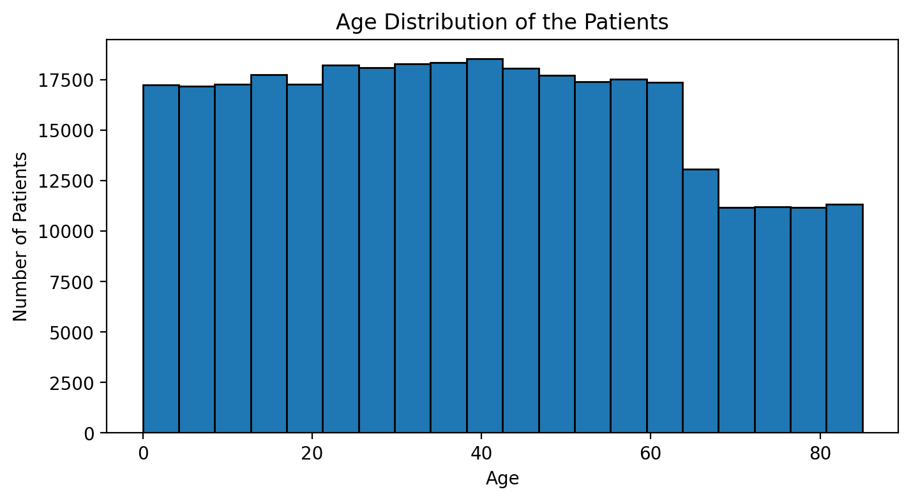

*Determine if any patients share the same exact age. Provide evidence for your findings.*<br>
I computed frequency counts for all ages and found no value occurring more than once; therefore, no patients share the same exact age.<br>
Evidence: dup_counts (duplicates-only dictionary) was {}, and len(ages) == len(age_counts), confirming no exact duplicates.

*Extra Credit: Explain how the existence (or non-existence) of multiple patients with the same age affects the solution to the rest of the problem.*<br>
If there are multiple patients with the same age:
- 1b. Gender distribution: No effect. The bar chart of gender counts is unchanged.
- 1c. Sort by age & identify the oldest: After sorting, the oldest age may appear multiple times.
- 1d. Second oldest: We must define what “second oldest” means if ties appear. For example, we can either choose the second record in sorted order (could have the same age as the oldest) or the second-oldest distinct age (the next lower age than the max). The timing will still be O(n) regardless. 
- 1e. Binary search for age = 41.5: Exact age search may return many patients, not just one.
- 1f. Count patients ≥ 41.5: No effect on the method or complexity. The number might change based on duplication. 
- 1g/1h. Count in an age range: totals (and male totals) might be higher if many patients share ages inside the interval. bisect_left(high) - bisect_left(low) still works. Time complexity remains the same.

**1b. Plot Gender Distribution**<br>
*Plot the distribution of genders from the dataset.*<br>

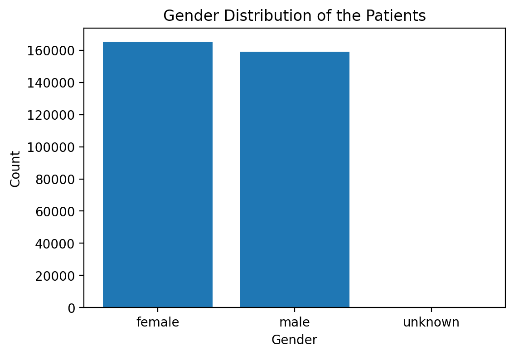

*Identify how gender is encoded in the data and list the categories used.*<br>
Gender is encoded as a string attribute (gender) on each <patient> element in the XML. There are three categories: female, male, and unknown (counts: female = 165,293; male = 158,992; unknown = 72).

**1c. Sort Patients by Age**<br>
*Sort the patients by age and store the result in a list. Identify the oldest patient.*<br>
The oldest patient is: {'name': 'Monica Caponera', 'age': 84.99855742449432, 'gender': 'female'}.<br>

**1d. Finding the Second Oldest Patient**<br>
*Describe a method to find the second oldest patient in O(n) time. Keep in mind sorting the list is O(n log n).*<br>
We scan the list once while keeping two variables:<br>
- top: the largest age seen so far,
- second: the largest age that is strictly less than top.

Steps:
1. Initialize top = None, second = None.
2. For each patient with age a:<br>
- If top is None or a > top:<br>
set second = top (if top exists), then set top = a.<br>
- Else if second is None or a > second:<br>
set second = a.<br>
3. After the scan:<br>
- If second is None, there are fewer than two distinct ages.
- Otherwise, second is the second-oldest distinct age. 

In this way, every age is compared only against the current best two. If an age beats top, it becomes the new top and the old top slides to second. Otherwise, if it sits between top and second, it updates second. Therefore, the time complexity is: exactly one pass, so O(n).<br>
The second oldest patient is: {'name': 'Raymond Leigh', 'age': 84.9982928781625, 'gender': 'male'}.

*Discuss scenarios where it is advantageous to sort the data versus using the O(n) solution.*<br>
It’s better to sort when we’ll reuse the ordering many times or need operations that depend on order. For example, after one sort (O(n log n)), we can quickly answer many follow-up questions like “who are the top k oldest?” and “how many are between 30 and 50?” using fast lookups (O(1) and O(log n), respectively). Sorting also helps when we need a ranked report or when we need to handle tie consistently. On the other hand, we can use the O(n) solution when we only need a single result like “what is the second oldest distinct age?”, and we don’t need the whole list in order.

**1e. Binary Search for Specific Age**<br>
*Implement a binary search (bisection) on your sorted list to find the patient who is exactly 41.5 years old.*<br>
The patient who is exactly 41.5 years old: {'name': 'John Braswell', 'age': 41.5, 'gender': 'male'}. 

**1f. Count Patients Above a Certain Age**<br>
*Use arithmetic to determine the number of patients who are at least 41.5 years old.*<br>
*Hint: There is a solution that follows almost immediately from the solution to 1e.*<br>
There are 150471 patients who are at least 41.5 years old.<br>

**1g. Function for Age Range Query**<br>
*Write a function that, in O(log n) time, returns the number of patients who are at least low_age years old but strictly less than high_age years old.*<br>
After sorting ages in ascending order, the function uses two binary searches to find the start and end indices of the interval [low_age,high_age). The count is the difference of those indices. Each query is O(log n).

*Test this function thoroughly and provide the test results.*<br>
Partition of the full range (should sum to n = 324357):<br>
[0, 21): 85645<br>
[21, 35): 60091<br>
[35, 50): 64112<br>
[50, 70): 74894<br>
[70, 90): 39615<br>
[90, 100): 0 (This aligns with what we found before: the max age is about 85)<br>
Sum check: The numbers add up to 324357, matching n. <br>

Small ranges:<br>
[41.5, 41.9): 1788<br>
[60, 61): 4211<br>

Boundary and degenerate cases:<br>
Empty interval [41.5, 41.5): 0<br>
Full span [-10^9, 10^9): 324357 (matching n)<br>
Below minimum [-100, 0): 0<br>
Above maximum [200, 300): 0 <br>

Check using 41.5:<br>
[41.4999999, 41.5): 0 (upper bound excluded)<br>
[41.5, 41.5000001): 1 (exactly one at 41.5)<br>

Additional Assertions:<br>
Expanding the interval shouldn't decrease the count: e.g., [40, 50) <= [18, 50); [10, 40) >= [10, 25).<br>
Another assertion for non-overlapping pieces add up to n (324357): [-∞, 41.5) + [41.5, 41.5) + [41.5, ∞) = n.<br>

**1h. Function for Age and Gender Range Query**<br>
*Modify your previous function(s) to also return the number of males in the specified age range, all in O(log n) time after initial data setup.*<br>
*Test this function thoroughly and justify its correctness.*<br>
Partition of the full range (totals and males; totals should sum to n = 324357; males should sum to 158992):<br>
[0, 21): total=85645, males=43648<br>
[21, 35): total=60091, males=29895<br>
[35, 50): total=64112, males=31751<br>
[50, 70): total=74894, males=35768<br>
[70, 90): total=39615, males=17930<br>
[90, 100): total=0, males=0<br>
Sum checks: totals add to 324357 (= n); males add to 158992 (dataset male total).<br>

Small ranges:<br>
[41.5, 41.9): total=1788, males=905<br>
[60, 61): total=4211, males=2060<br>

Boundary and degenerate cases:<br>
Empty interval [41.5, 41.5): total=0, males=0<br>
Full span [-10^9, 10^9): total=324357, males=158992<br>
Below minimum [-100, 0): total=0, males=0<br>
Above maximum [200, 300): total=0, males=0<br>

Check using 41.5:<br>
[41.4999999, 41.5): total=0, males=0 (upper bound excluded)<br>
[41.5, 41.5000001): total=1, males=1 (exactly one at 41.5, we know it's a male)<br>

Additional assertions:<br>
Expanding an interval shouldn't decrease counts (for totals and males): e.g., [40, 50) ≤ [18, 50); [10, 40) ≥ [10, 25).<br>
Another assertion for non-overlapping pieces add up to full span (for totals and males): [-∞, 41.5) + [41.5, 41.5) + [41.5, ∞) = full span.<br>

### Exercise 2: Low-level standards and their implications
**2a. Understanding the function**<br>
*Explain the logic behind this function; i.e., what does it appear that they are trying to do? What's the relationship between tstop, delta_t, and the number of doses administered?*<br>
The function is designed to simulate giving medication at regular intervals. It starts at time t = 0, and as long as the time is less than the total time tstop, it gives a dose and then adds delta_t to the time. Here, delta_t is the gap between doses, tstop is the overall treatment duration, and the number of doses depends on how many gaps of size delta_t fit before reaching tstop.

**2b. A first test case**<br>
*What happens when you call: administer_meds(0.25, 1)?* <br>
The function prints at t = 0, 0.25, 0.5, 0.75, so 4 doses are given as expected.<br>
Full result: <br>
Administering meds at t=0<br>
Administering meds at t=0.25<br>
Administering meds at t=0.5<br>
Administering meds at t=0.75<br>

**2c. A second test case**<br>
*What happens when you call: administer_meds(0.1, 1)*<br>
The function prints lines like t=0.30000000000000004 and it prints an extra time at about t=0.9999999999999999, so we get 11 doses instead of the expected 10.<br>
Full result:<br>
Administering meds at t=0<br>
Administering meds at t=0.1<br>
Administering meds at t=0.2<br>
Administering meds at t=0.30000000000000004<br>
Administering meds at t=0.4<br>
Administering meds at t=0.5<br>
Administering meds at t=0.6<br>
Administering meds at t=0.7<br>
Administering meds at t=0.7999999999999999<br>
Administering meds at t=0.8999999999999999<br>
Administering meds at t=0.9999999999999999<br>

**2d. Interpreting the surprise**<br>
*Discuss your findings. Did you always get the exact times you expected? Did you always get the number of doses you expected?*<br>
No, I didn't get the exact times and number of doses as I expected. The times don’t always print as neat decimals because computers can’t store numbers like 0.3 or 0.9 exactly in binary. Some values (like 0.1 or 0.2) round nicely when printed, but others show up as 0.30000000000000004 or 0.8999999999999999.<br>
This tiny error also makes the loop run too many times. Instead of stopping at exactly t = 1.0, the program ends at t = 0.9999999999999999, which is still less than 1, so it prints one extra dose.

**2e. Clinical implications**<br>
*Comment on the clinical significance (or insignificance) of each “surprise.” Why might even small deviations be important in a medical setting?*<br>
In real devices, even small mistakes can matter a lot. For example, an extra or missed dose could be harmful if the medicine is strong, like insulin or heart drugs. Also, small drifts in timing could make the treatment go out of sync with other equipment or safety checks. That’s why predictable and exact behavior is very important in medical settings.

**2f. A safer implementation**<br>
*Write a revised version of administer_meds that avoids surprises and behaves predictably.*<br>
*Explain what you changed and why it works better.*<br>
I changed the function to use Python’s Decimal type instead of normal floats. This avoids tiny rounding errors, so numbers like 0.3 or 0.9 print exactly as expected. It also stops the loop at the right time, so the number of doses is predictable and consistent.

### Exercise 3: Algorithm Analysis and Performance Measurement
**3a. Hypothesize the Operation**<br>
*Run a few tests on the algorithms and use the results to hypothesize what type of operation each function performs on a list of values. (To be clear, both algorithms create the same output.)*<br>
*Include your test cases and results in your README file to support your hypothesis.*<br>
I tested both alg1 and alg2 on several datasets (generated by data1, data2, data3, and manual examples). From these tests, both algorithms consistently sort the list into ascending order. They produce the same results regardless of input (already sorted, reverse sorted, random, or empty). Therefore, alg1 and alg2 are both sorting (ascending order) algorithms.<br>

| Dataset            | Input                                               | alg1 Output                                         | alg2 Output                                         | Same? |
| ------------------ | --------------------------------------------------- | --------------------------------------------------- | --------------------------------------------------- | ----- |
| `data1(5)`         | `[31.0, 31.026, 31.075..., 31.145..., 31.236...]`   | `[31.0, 31.026, 31.075..., 31.145..., 31.236...]`   | `[31.0, 31.026, 31.075..., 31.145..., 31.236...]`   | yes     |
| `data2(10)`        | `[0, 1, 2, 3, 4, 5, 6, 7, 8, 9]`                    | `[0, 1, 2, 3, 4, 5, 6, 7, 8, 9]`                    | `[0, 1, 2, 3, 4, 5, 6, 7, 8, 9]`                    | yes     |
| `data3(10)`        | `[10, 9, 8, 7, 6, 5, 4, 3, 2, 1]`                   | `[1, 2, 3, 4, 5, 6, 7, 8, 9, 10]`                   | `[1, 2, 3, 4, 5, 6, 7, 8, 9, 10]`                   | yes     |
| Manual random list | `[10, 3, 3, 4.1, 0, 7.99, 100, 2, 0, 1, -1, -0.01]` | `[-1, -0.01, 0, 0, 1, 2, 3, 3, 4.1, 7.99, 10, 100]` | `[-1, -0.01, 0, 0, 1, 2, 3, 3, 4.1, 7.99, 10, 100]` | yes     |
| Empty list         | `[]`                                                | `[]`                                                | `[]`                                                | yes     |

**3b. Explain the algorithms**<br>
*Provide an intuitive, high-level explanation of how alg1 works. Describe the overall approach without going into line-by-line detail.*<br>
alg1 (Bubble Sort):<br>
This algorithm goes through the list from left to right repeatedly and swaps neighbors if they are in the wrong order. After each pass, the biggest value moves to the end of the list, like a bubble rising to the top. The improvement here is the early exit check. If a whole pass finishes without any swaps, the algorithm stops right away because the list is already sorted. This makes it quick on sorted or nearly sorted lists (about O(n) time), but on average or in the worst case it still takes O(n²), which is slow for large and messy lists.

alg2 (Merge Sort):<br>
This algorithm sorts by dividing the list into smaller parts, sorting those parts, and then merging them back together. The list is split in half again and again until only single elements remain. Then the halves are merged: at each step, the smaller front element is picked and added to the new list. Because of this structured process, the algorithm always runs in about O(n log n) time, no matter how the input looks, which makes it reliable and efficient for large lists.

**3c. Performance Measurement and Analysis**<br>
*Time the performance of alg1 and alg2 using time.perf_counter for various sizes of data n. Use the data1 function to generate the data.*<br>
Times are generated using data1 with sizes = [1, 3, 13, 51, 193, 719, 2682, 10000] respectively.<br>
Example times of alg1 on data1:<br>
[3.7497375160455704e-07,<br>
 5.00003807246685e-07,<br>
 8.330098353326321e-07,<br>
 0.0001105829724110663,<br>
 0.0013671659980900586,<br>
 0.04737920896150172,<br>
 0.7581884160172194,<br>
 10.548196875024587] <br>

 Example times of alg2 on data1:<br>
 [2.92027834802866e-07,<br>
 3.167020622640848e-06,<br>
 2.158299321308732e-05,<br>
 6.679102079942822e-05,<br>
 0.00027304200921207666,<br>
 0.0012139170430600643,<br>
 0.004626166948582977,<br>
 0.02261916600400582]<br>

*Plot the performance on a log-log graph as a function of n. Describe the apparent big-O scaling of each algorithm.*<br>
log-log graph for alg1 on d1:

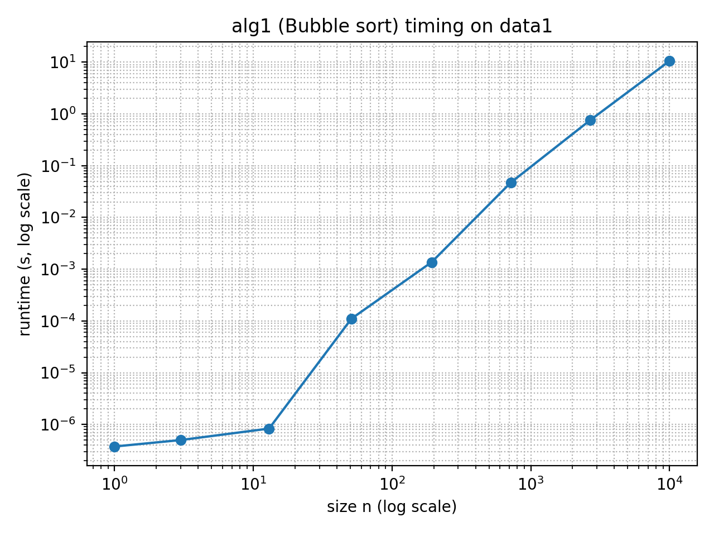

log-log graph for alg2 on d1:

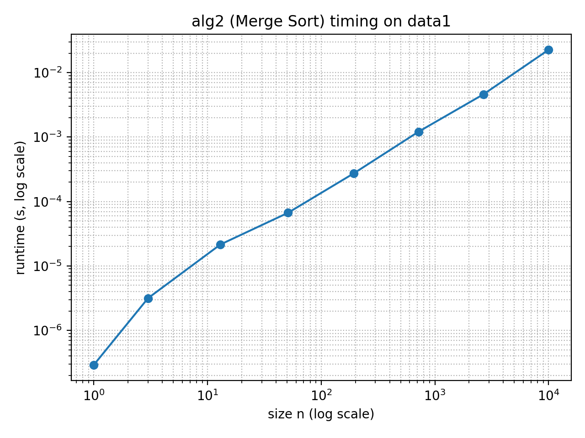s

Comparison of performance for alg1 and alg2 on d1:

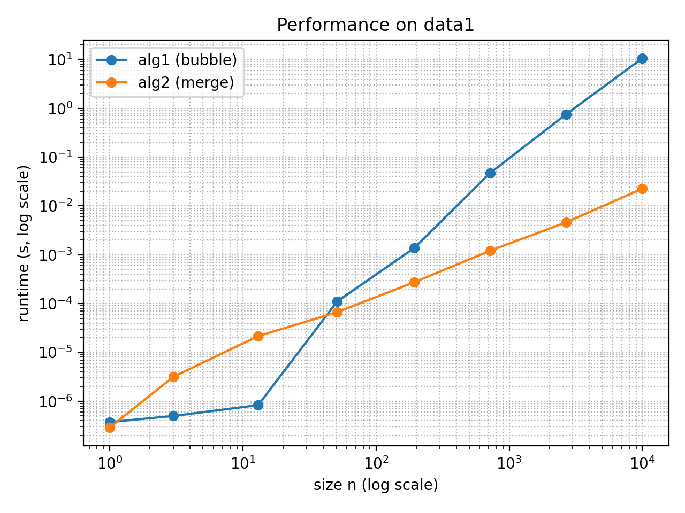

Apparent big-O scaling of each algorithm on d1:<br>
alg1 (bubble sort): Runtime grows approximately O(n^2) on data1. We can see that the log–log curve is steep and close to a slope of ~2.<br>
alg2 (merge sort): Runtime grows approximately O(nlogn) regardless of input order. We can see that the log–log curve is much shallower than n^2, which is consistent with nlogn.<br>

*Repeat the timing and plotting process using the data2 function to generate data.*<br>
Comparison of performance for alg1 and alg2 on d2:

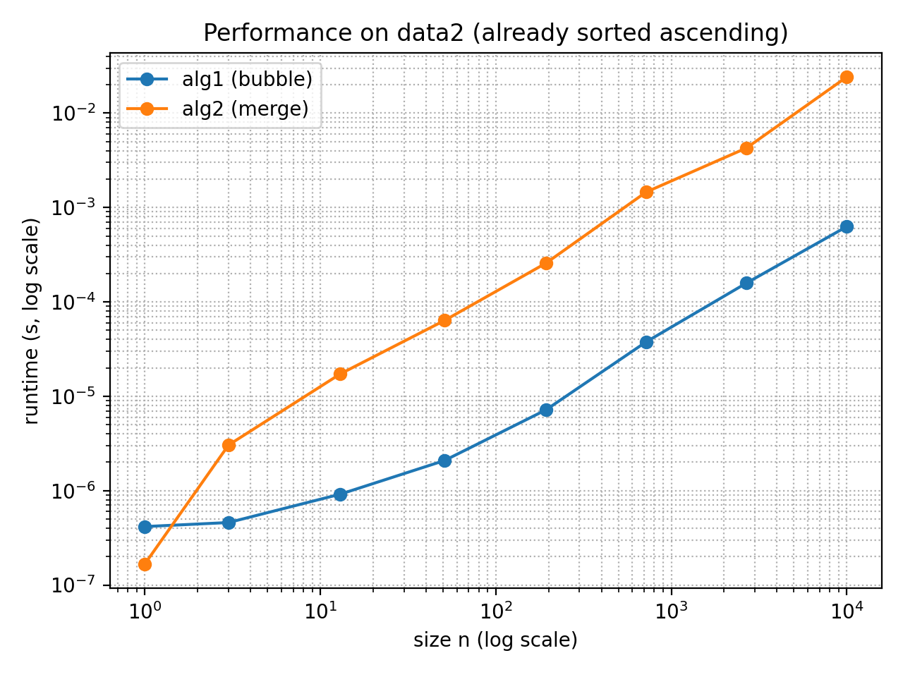

*Repeat the timing and plotting process using the data3 function to generate data.*<br>
Comparison of performance for alg1 and alg2 on d3:

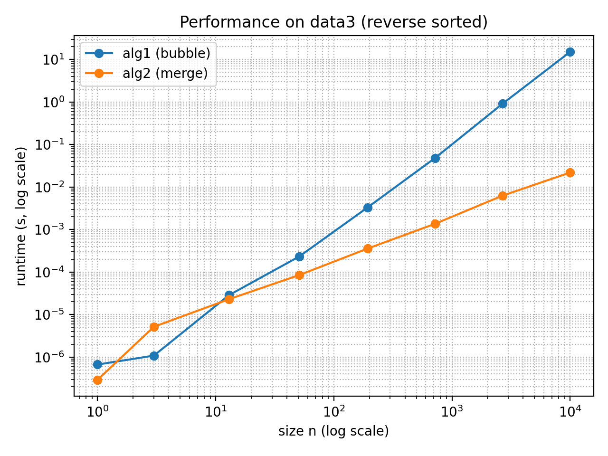

**3d. Conclusions and recommendations**<br>
*Discuss how the performance scales across the three data sets.*<br>
data1 (random floats):<br>
alg1: grows ≈ O(n²).<br>
alg2: grows ≈ O(n log n).<br>
So alg2 is much faster as n increases.<br>

data2 (sorted ascending):<br>
alg1: ≈ O(n) (no swaps needed; stops after one pass).<br>
alg2: ≈ O(n log n) (splits/merges regardless of order).<br>
For small or medium sized lists, alg1 can be as fast as (or faster than) alg2. For large lists, alg2 is the safer choice.<br>

data3 (sorted descending):<br>
alg1: near worst-case O(n²) (many passes and swaps).<br>
alg2: ≈ O(n log n) (splits/merges regardless of order).<br>
alg2 strongly dominates.<br>

*Recommend which algorithm would be preferable for different types of data and justify your recommendation based on your findings.*<br>
- Most cases/ large lists/ unknown order: use alg2 (merge sort). It stays fast and reliable (about O(nlogn)) no matter how the data looks.<br>
- lready or nearly sorted, and the list isn’t big: alg1 (bubble sort with early exit) is fine and can be faster because it may finish after one pass (about o(n)).<br>
- Reverse-sorted or bad order: avoid alg1 (it can be O(n^2) and very slow). Use alg2 instead.<br>
- If we want safe performance without guessing about the data: Use alg2. It stays consistent and reliable all the time.<br>
Thereofore, pick merge sort by default, especially for big or messy data; use bubble sort with early exit only for small lists that are already or almost sorted.<br>

### Exercise 4: Implementing and Analyzing a Binary Search Tree as a tool for organizing data
**4a. Implement the add Method** <br>
*Extend the given Tree class to create a binary search tree. Implement the add method to insert a value and associated data (e.g., patient ID and patient information) into the tree according to the rules for a binary search tree.*<br>
my_tree is constructed successfully using the add method.

**4b. Implement a __contains__ Method**<br>
*Test this functionality. (Include your tests in the readme. In your tests, be sure to use in not __contains__.)*<br>
Positive tests:<br>
print(24601 in my_tree)   # True<br>
print(42 in my_tree)      # True<br>
print(8675309 in my_tree) # True<br>
print(7 in my_tree)       # True<br>
print(143 in my_tree)     # True<br>

Negative tests:<br>
print(1492 in my_tree)    # False<br>
print(1 in my_tree)       # False<br>
print(2333 in my_tree)    # False<br>

Empty tree test:<br>
empty = Tree()<br>
print(0 in empty)         # False<br>

Keys that were inserted (24601, 42, 7, 8675309, 143) return True.<br>
Keys not present (1492, 1, 2333) return False.<br>
An empty tree correctly reports False for any key.<br>

**4c. Implement and Test a has_data Method**<br>
*Test your method and provide evidence that it works.*<br>
Positive tests:<br>
has_data('JV'): True<br>
has_data('DA'): True<br>
has_data('JB'): True<br>
has_data('FR'): True<br>
has_data('JNY'): True<br>

Negative tests:<br>
has_data('ABC'): False<br>
has_data(24601): False<br>

Empty tree test:<br>
empty.has_data('BALABALA') -> False<br>

Data that was inserted ('JV', 'DA', 'JB', 'FR', 'JNY') returns True.<br>
Data not present ('ABC') returns False. 24601 was intended to be a key, not a data, so it returns False. <br>
An empty tree correctly reports False for any data.<br>

**4d. Performance Analysis of __contains__ and has_data**<br>
*Timing the __contains__ Method: Populate the tree with random patient IDs and associated data of various sizes n. Measure the time taken for multiple in operations (after the tree has been constructed). Plot these timings on a log-log graph. The graph should show that the time required for checking if a number is in the tree approaches O(logn) for sufficiently large n.*<br>

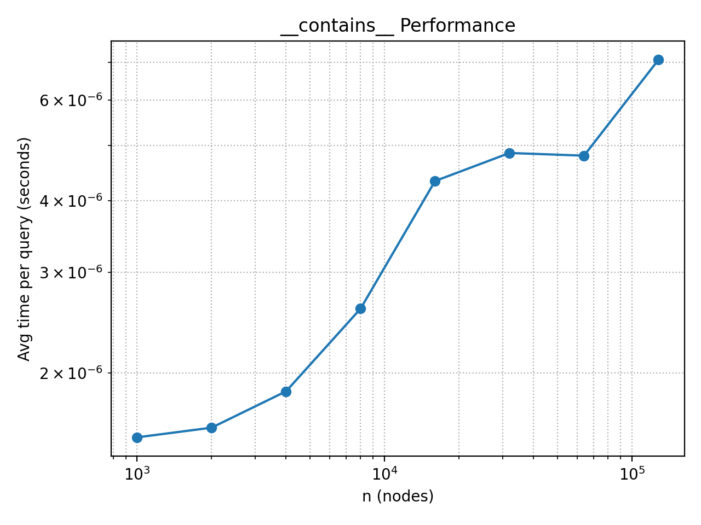

*Timing the has_data Method. Discuss how the performance of both methods compares.*<br>

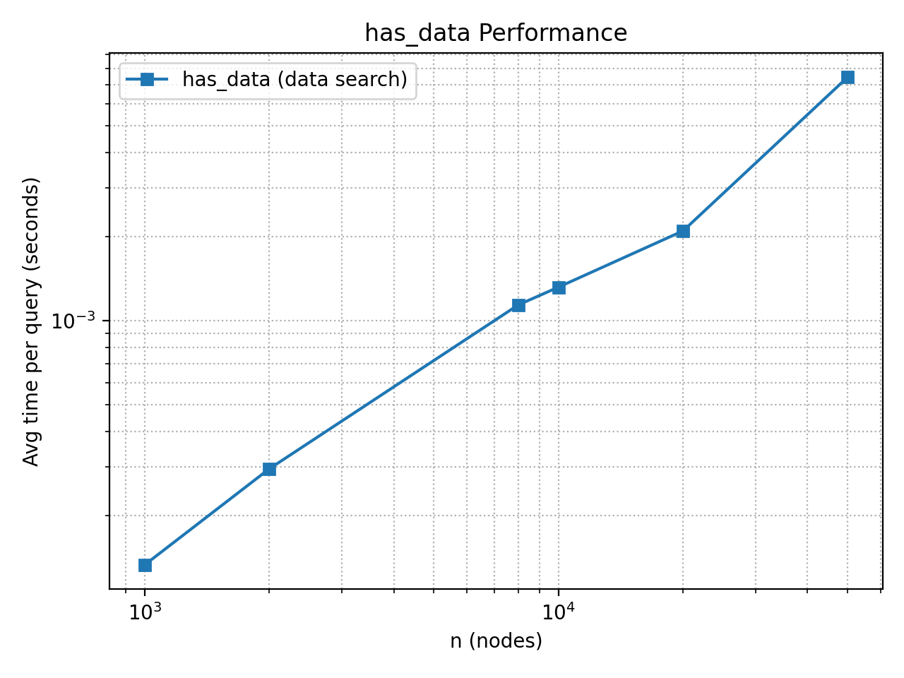

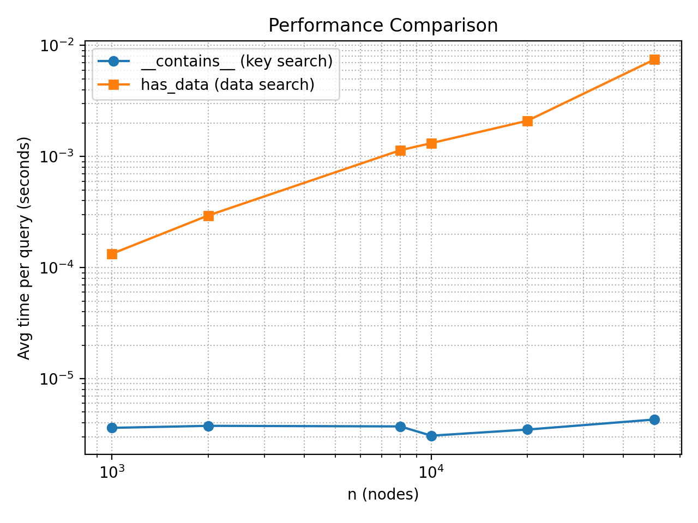

The __contains__ method is much more efficient than has_data, especially as the tree gets larger. This is because __contains__ only needs to follow one path down the tree, so the time grows slowly, about like logn. In contrast, has_data has no ordering for the stored data and may need to check through many nodes, which makes it grow about like n. On the log–log plot, __contains__ looks almost flat, but has_data increases steadily with a slope close to 1. This shows that searching by key is fast even in big trees, while searching by data is much slower.

*Setup Time Analysis: Measure and plot the time to construct the tree for various sizes. The runtime should be between curves representing O(n) and O(n^2).*<br>

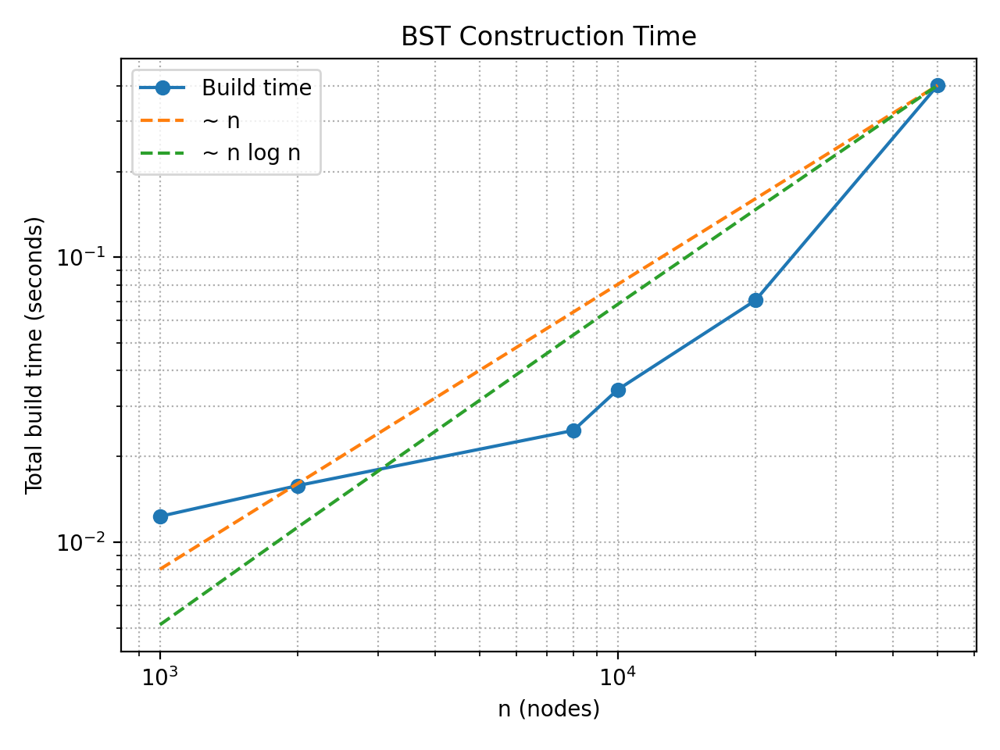

**4e. Discussing Choice of Test Data**<br>
*Explain why it is unrepresentative to always use a specific value (e.g., patient_id = 1) as test data or to only use one test point for performance analysis. Discuss the implications of choosing appropriate test data for accurately assessing performance.*<br>
Always using the same value (e.g., patient_id = 1) or only one test point gives a biased view of performance. The time to search in a binary search tree depends on how deep the value is in the tree and whether it is found or not. A single fixed value may be very fast or very slow, but it does not reflect the average case. Also, one measurement cannot show how runtime changes as the tree grows. To assess performance fairly, we need many test values (both present and absent) across different tree sizes. This provides a more accurate picture of average behavior and allows us to see whether the results match the expected growth rates (log n for key search and linear for data search).

### Exercise 5: Choosing ontologies for clinical research data
**5a. Recommended ontology set**<br>
1. SNOMED CT (SCTID) — for clinician notes and imaging reports (findings, anatomy, procedures)<br>
- Gap it fills: Gives a single, standard way to label problems, symptoms, body sites, and procedures, which is something the drug and genomics vocabularies don’t cover.<br>
- How complete/specific: Very large and detailed; good for turning free text in notes and radiology/pathology reports into consistent, searchable terms.<br>
- Why it helps across data types: The same anatomy/findings terms work in both notes and imaging narratives, so searches line up across sources.<br>

2. RxNorm (RXNORM) - for medication records and drug mentions in notes<br>
- Gap it fills: Provides normalized IDs for clinical drugs at the level people actually order (ingredient + strength + dose form).<br>
- How complete/specific: Highly specific to real products and updated frequently, which helps merge different spellings or brand/generic names.<br>
- Why it helps across data types: Connects structured med lists with drug mentions in notes so medication queries are consistent everywhere.<br>

3. NCI Thesaurus (NCIt) - for oncology concepts in notes, imaging/pathology, and biomarkers<br>
- Gap it fills: Adds cancer-specific detail (histology, staging, biomarkers, therapies) that general clinical vocabularies don’t cover well.<br>
- How complete/specific: Broad, research-grade coverage with clear terms and synonyms, which is well suited to a cancer hospital.<br>
- Why it helps across data types: The same NCIt IDs can tag pathology diagnoses, radiology impressions, staging in notes, and biomarker results, keeping cancer terms aligned.<br>

4. Sequence Ontology (SO) - for gene sequence metadata<br>
- Gap it fills: Standard names for genomic features and variant consequences (e.g., exon, missense_variant) that clinical/drug ontologies lack.<br>
- How complete/specific: Widely used in genomics; specific enough to filter by variant type instead of only searching text.<br>
- Why it helps across data types: Lets molecular results link cleanly to cancer concepts (e.g., variants related to certain tumor types or biomarkers).<br>

5. RadLex (RADLEX) - for imaging concepts and protocol names (radiology)<br>
- Gap it fills: Gives standard, easy-to-read names for radiology exams and sequences (e.g., “CT pulmonary angiography”). This fixes messy, inconsistent local protocol names.
- How complete/specific: Radiology-focused and well-maintained by RSNA; widely used for protocol naming and search. It also links to the RSNA/LOINC Playbook.
- Why it helps across data types: Pairs nicely with SCTID/NCIt. You can search findings/diagnoses (SNOMED/NCIt) together with standardized exam/protocol names (RadLex).

This keeps the set small but covers everything we need: genes, meds, clinical text, and imaging contents.<br>

**5b. Licensing and alternatives**<br>
1) SNOMED CT (SCTID)
- License / access: It's free to use in the United States through a UMLS account, which requires accepting the UMLS license terms. Outside the U.S., use follows SNOMED International’s country/affiliate rules.
- Alternative: MONDO Disease Ontology (CC BY 4.0) (free to use worldwide; strong for disease normalization across sources). 
- Why the alternative is acceptable: MONDO is open, actively maintained, and works well for normalizing disease names in research.
- Why the preferred choice is still better: It covers not only diseases but also findings, symptoms, anatomy, and procedures. It is deeper and more flexible for coding free-text notes and imaging findings.
- Discovery/maintenance trade-offs: SNOMED CT has strong vendor support, frequent updates via UMLS, and many existing mappings, which makes search and integration easier.

2) RxNorm (RXNORM)
- License / access: RxNorm is distributed by the U.S. National Library of Medicine. It is free to use with a UMLS account and license acceptance.
- Alternative: WHO ATC/DDD (good open option for drug classes and utilization studies).
- Why the alternative is acceptable: ATC/DDD is well-known internationally and useful for class-level analysis.
- Why the preferred choice is still better: RxNorm represents clinical drugs at the level clinicians order and dispense (ingredient + strength + dose form). This is important for reconciling EHR orders, pharmacy data, and drug mentions in notes.
- Discovery/maintenance trade-offs: RxNorm has regular monthly and weekly updates and mature APIs/browsers, which supports reliable data integration.

3) NCI Thesaurus (NCIt)
- License / access: NCIt is open and released under CC BY 4.0, which allows reuse with attribution.
- Discovery/maintenance trade-offs: NCIt is actively curated by the NCI, with stable releases, web browsers, and APIs, which makes it easy to discover and maintain terms.

4) Sequence Ontology (SO)
- License / access: SO is open and released under CC BY 4.0, which allows reuse with attribution.
- Discovery/maintenance trade-offs: SO is part of the OBO community, has active maintainers, and is widely used in bioinformatics pipelines, which helps with long-term usability.

5) RadLex (RADLEX)
- License / access: RadLex is free to use (worldwide, commercial and non-commercial). We just need to accept the RSNA RadLex license. There is no fee.
- Alternative: DICOM Controlled Terminology (PS3.16). It’s part of the DICOM standard and is free to read and implement.
- Why the alternative is acceptable: DICOM gives exact, machine-level codes for how the scan was done. It’s great if we mainly need technical parameters for filtering and reproducibility.
- Why the preferred choice is still better: It's better if we want clear, human-friendly names for exams and protocols. RadLex is designed for clinicians, uses easy-to-read labels, and links to the RSNA/LOINC Playbook, which makes search, protocol naming, and QA dashboards easier.
- Discovery/maintenance trade-offs: RADLEX is maintained by RSNA, updated regularly, widely used in radiology. It's easy to browse and download.

**5c. Search methodology and stopping rule**<br>
Search methodology: <br>

1) Start with realistic text, then run a recommender.<br>
I submitted short sentences that look like our data to NCBO BioPortal Ontology Recommender.<br>
Example texts: “CT chest with contrast shows a 12 mm ground-glass nodule; pathology report: lung adenocarcinoma, PD-L1 positive; NGS found EGFR exon 19 deletion; patient started osimertinib.”<br>

2) Check official catalogs/pages.<br>
I confirmed scope, updates, and licenses in OBO Foundry (SO), NCBO BioPortal, and steward sites: NLM/UMLS (SNOMED CT, RxNorm), NCI EVS (NCIt), and RSNA RadLex pages (for RadLex and Playbook/LOINC-RSNA links).<br>

3) Quick coverage check.
Molecular/variants: Sequence Ontology (SO)<br>
Clinical/notes (+ imaging findings): SNOMED CT<br>
Medications: RxNorm<br>
Cancer terms across sources: NCIt<br>
Imaging concepts & protocol naming (radiology): RadLex<br>

4) Quick manual check.
I mapped a few real phrases:<br>
“Ground-glass opacity” → SNOMED CT<br>
“Lung adenocarcinoma / PD-L1” → NCIt<br>
“Osimertinib” → RxNorm<br>
“Missense_variant” → SO<br>
“CT pulmonary angiography / MR T2 FLAIR” (exam/protocol names) → RadLex<br>
These checks showed each ontology covers a distinct need with little overlap.<br>

Stopping rules:<br>

- Rule 1: One primary per data type.<br>
SO (molecular), SNOMED CT (clinical/notes + imaging findings), RxNorm (meds), RadLex (radiology imaging concepts/protocol names).<br>

- Rule 2: One cross-cutting cancer layer.<br>
Add NCIt for histology, staging, and biomarkers that appear in notes, imaging, and molecular results.<br>

- Rule 3: No duplication.<br>
Do not include two ontologies for the same slice (e.g., a second drug ontology).<br>

- Rule 4: Handle heavy overlap by picking one.<br>
If two options overlap a lot on the same concept set (>~40%), keep the one with better mapping for hospital use.<br>

- Rule 5: Must be practical to maintain.<br>
Each ontology must have stable releases and easy access (UMLS/EVS/OBO/RSNA downloads and APIs).<br>

## Appendix: Full Code
```python
# -----------------------
# Exercise 1
# -----------------------
# import element tree under the alias of ET
import xml.etree.ElementTree as ET
import matplotlib.pyplot as plt
from collections import Counter
from bisect import bisect_left

# 1a. Plot Age Distribution
# Load the patient data 
# pass the path of the xml document to enable the parsing process
tree = ET.parse('data/pset1-patients.xml')

# get the parent tag of the xml document
root = tree.getroot()

patients = []
for patient in root.find("patients").findall("patient"):
    name = patient.attrib.get("name", "Unknown")
    gender = patient.attrib.get("gender", "Unknown")
    try:
        age = float(patient.attrib["age"])
    # if "age" doesn’t exist or can’t be converted, set to None
    except (KeyError, ValueError):
        age = None

    patients.append({
        "name": name,
        "age": age,
        "gender": gender
    })

print("Total patients:", len(patients)) 
print("First 5 records:", patients[:5])

# Plot a histogram showing the distribution of ages
ages = []
for p in patients:
    if p["age"] is not None:
        ages.append(p["age"])
len(ages) #324357 ages
hist_age_fig = plt.figure(figsize=(8,4))
plt.hist(ages, bins=20, edgecolor='black')
plt.title("Age Distribution of the Patients")
plt.xlabel("Age")
plt.ylabel("Number of Patients")
hist_age_fig.savefig("plots/1a_age.png", dpi=200, bbox_inches="tight")

# Determine if any patients share the same exact age.
# count how many times each age appears
age_counts = Counter(ages)

# keep only duplicates (count > 1)
dup_counts = {}
for age, count in age_counts.items():
    if count > 1:
        dup_counts[age] = count

print("Duplicates:", dup_counts)  # {} means none
print("Total with age:", len(ages), "; Unique ages:", len(age_counts))

# 1b. Plot Gender Distribution
genders = []
for p in patients:
    genders.append(p["gender"])

gender_counts = Counter(genders)
print(gender_counts) #{'female': 165293, 'male': 158992, 'unknown': 72}

labels = ["female", "male", "unknown"]
values = []
for k in labels:
    values.append(gender_counts[k])

bar_gender_fig = plt.figure(figsize=(6,4))  
plt.bar(labels, values)
plt.title("Gender Distribution of the Patients")
plt.xlabel("Gender")
plt.ylabel("Count")
bar_gender_fig.savefig("plots/1b_gender.png", dpi=200, bbox_inches="tight")

# Identify how gender is encoded in the data and list the categories used
print("Encoding: `gender` attribute on <patient>.")
print("Categories:", sorted(gender_counts.keys()))
print("Counts:", dict(gender_counts))

# 1c. Sort Patients by Age
# descending by age
patients_sorted = sorted(patients, key=lambda p: p["age"], reverse=True)
oldest = patients_sorted[0] 
oldest

# 1d. Finding the Second Oldest Patient
def second_oldest(patients):
    top = None
    second = None
    for p in patients:
        a = p["age"]
        if top is None or a > top:
            if top is not None:
                second = top
            top = a
        elif second is None or a > second:
            second = a
    if second is None:
        return None, []
    
    # Returns a list of all matching patients (though each age is unique in this dataset)
    second_oldest_p = [p for p in patients if p["age"] == second]
    return second, second_oldest_p
second_oldest(patients)

# 2e. Binary Search for Specific Age
patients_sorted_ascend = sorted(patients, key=lambda p: p["age"])
ages_sorted_ascend = [p["age"] for p in patients_sorted_ascend] 
target = 41.5

# bisect_left gives the first position where 41.5 fits in the sorted list.
i = bisect_left(ages_sorted_ascend, target) 

# If 41.5 is present, that index is its first occurrence; 
if i < len(ages_sorted_ascend) and ages_sorted_ascend[i] == target:
    match = patients_sorted_ascend[i]
    print("Match:", match)
# otherwise it’s the insert spot (i.e., no match is found).
else: 
    first_match = None
    print("No exact 41.5 found.")

# 1f. Count Patients Above a Certain Age
# i = bisect_left(ages_sorted_ascend, target) gives the first index with age >= 41.5
count = len(ages_sorted_ascend) - i  # all patients from index i to end
count 

# 1g. Function for Age Range Query
def count_in_age_range(ages_sorted_ascend, low_age, high_age):
    if high_age <= low_age:
        return 0  
    low_index = bisect_left(ages_sorted_ascend, low_age)    # first index with age >= low_age
    high_index = bisect_left(ages_sorted_ascend, high_age)  # first index with age >= high_age
    return max(0, high_index - low_index)

# Test for 1g
def run_tests_1g():
    a = ages_sorted_ascend  
    n = len(a)

    tests = [
        # normal ranges that span all ages; should add up to n (324357)
        ("[0, 21)", 0, 21),
        ("[21, 35)", 21, 35),
        ("[35, 50)", 35, 50),
        ("[50, 70)", 50, 70),
        ("[70, 90)", 70, 90),
        ("[90, 100)", 90, 100), #should be 0 in our dataset 

        # small ranges
        ("[41.5, 41.9)", 41.5, 41.9),
        ("[60, 61)", 60, 61),
        
        # boundary cases
        ("empty when low==high", 41.5, 41.5), #should be 0
        ("spans all ages", -1e9, 1e9), #should be n

        # degenerate cases
        ("below min", -100, 0), #should be 0
        ("above max", 200, 300), #should be 0
    
        # check using 41.5
        ("just below 41.5", 41.4999999, 41.5), #should be 0
        ("just above 41.5", 41.5, 41.5000001), #should be 1
    ]

    for label, low, high in tests:
        number = count_in_age_range(a, low, high)
        print(f"{label}: {number}")

    # Expanding the interval shouldn't decrease the count
    assert count_in_age_range(a, 40, 50) <= count_in_age_range(a, 18, 50)
    assert count_in_age_range(a, 10, 40) >= count_in_age_range(a, 10, 25)

    # another test for non-overlapping pieces add up to n (324357)
    left  = count_in_age_range(a, -1e9, 41.5)
    middle = count_in_age_range(a, 41.5, 41.5)   #should be 0
    right = count_in_age_range(a, 41.5, 1e9)
    assert left + middle + right == n

run_tests_1g()

# 1h. Function for Age and Gender Range Query
# Build a sorted age list for males
male_ages_sorted_ascend = sorted(p["age"] for p in patients if p.get("gender") == "male")
print(len(male_ages_sorted_ascend))

def count_in_age_range_with_males(ages_sorted_ascend, male_ages_sorted_ascend, low_age, high_age):
    if high_age <= low_age:
        return 0, 0

    low_index = bisect_left(ages_sorted_ascend, low_age)
    high_index = bisect_left(ages_sorted_ascend, high_age)
    total_count = max(0, high_index - low_index)

    mlow_index = bisect_left(male_ages_sorted_ascend, low_age)
    mhigh_index = bisect_left(male_ages_sorted_ascend, high_age)
    male_count = max(0, mhigh_index - mlow_index)

    return total_count, male_count

    # Test for 1h
def run_tests_1h():
    a = ages_sorted_ascend
    m = male_ages_sorted_ascend
    n = len(a)
    n_male = len(m)

    tests = [
        # normal ranges that span all ages; totals should add up to count_in_age_range(a, 0, 100)
        ("[0, 21)", 0, 21),
        ("[21, 35)", 21, 35),
        ("[35, 50)", 35, 50),
        ("[50, 70)", 50, 70),
        ("[70, 90)", 70, 90),
        ("[90, 100)", 90, 100),  # should be 0 in our datasets

        # small ranges
        ("[41.5, 41.9)", 41.5, 41.9),
        ("[60, 61)", 60, 61),

        # boundary cases
        ("empty when low==high", 41.5, 41.5),  # should be 0
        ("spans all ages", -1e9, 1e9),         # should be n, n_male

        # degenerate cases
        ("below min", -100, 0),                # should be 0
        ("above max", 200, 300),               # should be 0

        # checks using 41.5
        ("just below 41.5", 41.4999999, 41.5),     # should be 0
        ("just above 41.5", 41.5, 41.5000001),     # should be 1
    ]

    total_bins_sum = 0
    male_bins_sum  = 0

    for label, low, high in tests:
        total_count, male_count = count_in_age_range_with_males(a, m, low, high)
        print(f"{label}: total={total_count}  males={male_count}")

        assert 0 <= male_count <= total_count

        if label in {"[0, 21)", "[21, 35)", "[35, 50)", "[50, 70)", "[70, 90)", "[90, 100)"}:
            total_bins_sum += total_count
            male_bins_sum  += male_count

    # Partition sums equal the full 0–100 query
    full_total_0_100, full_male_0_100 = count_in_age_range_with_males(a, m, 0, 100)
    assert total_bins_sum == full_total_0_100
    assert male_bins_sum  == full_male_0_100

    # Expanding the interval shouldn't decrease counts (totals and males)
    t1, m1 = count_in_age_range_with_males(a, m, 40, 50)
    t2, m2 = count_in_age_range_with_males(a, m, 18, 50)
    assert t1 <= t2 and m1 <= m2
    t3, m3 = count_in_age_range_with_males(a, m, 10, 40)
    t4, m4 = count_in_age_range_with_males(a, m, 10, 25)
    assert t3 >= t4 and m3 >= m4

    # Non-overlapping pieces add up to the whole (around 41.5)
    left_t, left_m   = count_in_age_range_with_males(a, m, -1e9, 41.5)
    middle_t,  middle_m    = count_in_age_range_with_males(a, m,  41.5, 41.5)  # should be 0
    right_t, right_m = count_in_age_range_with_males(a, m,  41.5, 1e9)
    assert (left_t + middle_t + right_t) == count_in_age_range_with_males(a, m, -1e9, 1e9)[0]
    assert (left_m + middle_m + right_m) == count_in_age_range_with_males(a, m, -1e9, 1e9)[1]

run_tests_1h()

# -----------------------
# Exercise 2
# -----------------------
def administer_meds(delta_t, tstop):
    t = 0
    while t < tstop: 
        print(f"Administering meds at t={t}")
        t += delta_t

# 2b. A first test case
administer_meds(0.25, 1)

# 2c. A second test case
administer_meds(0.1, 1)

# 2f. A safer implementation
from decimal import Decimal

def safer_administer_meds(delta_t, tstop):
    dt = Decimal(str(delta_t))
    T  = Decimal(str(tstop))
    k = 0
    while (dt * k) < T:                
        t = dt * k                     
        print(f"Administering meds at t={t}")
        k += 1

safer_administer_meds(0.1, 1)
safer_administer_meds(0.3, 1)

# -----------------------
# Exercise 3
# -----------------------
# algorithm 1
def alg1(data):
  data = list(data)
  changes = True
  while changes:
    changes = False
    for i in range(len(data) - 1):
      if data[i + 1] < data[i]:
        data[i], data[i + 1] = data[i + 1], data[i]
        changes = True
  return data

# algorithm 2
def alg2(data):
  if len(data) <= 1:
    return data
  else:
    split = len(data) // 2
    left = iter(alg2(data[:split]))
    right = iter(alg2(data[split:]))
    result = []
    # note: this takes the top items off the left and right piles
    left_top = next(left)
    right_top = next(right)
    while True:
      if left_top < right_top:
        result.append(left_top)
        try:
          left_top = next(left)
        except StopIteration:
          # nothing remains on the left; add the right + return
          return result + [right_top] + list(right)
      else:
        result.append(right_top)
        try:
          right_top = next(right)
        except StopIteration:
          # nothing remains on the right; add the left + return
          return result + [left_top] + list(left)

def data1(n, sigma=10, rho=28, beta=8/3, dt=0.01, x=1, y=1, z=1):
    import numpy
    state = numpy.array([x, y, z], dtype=float)
    result = []
    for _ in range(n):
        x, y, z = state
        state += dt * numpy.array([
            sigma * (y - x),
            x * (rho - z) - y,
            x * y - beta * z
        ])
        result.append(float(state[0] + 30))
    return result

df1 = data1(5)
df1

# sorted ascending dataset
def data2(n):
    return list(range(n))

df2 = data2(10)
df2

# sorted descending dataset
def data3(n):
    return list(range(n, 0, -1))

df3 = data3(10)
df3

# 3a. Hypothesize the Operation
# Test alg1 on df1,2,3 generated by data1,2,3
print(alg1(df1))
print(alg1(df2))
print(alg1(df3))

# Test alg2 on df1,2,3 generated by data1,2,3
print(alg2(df1))
print(alg2(df2))
print(alg2(df3))

# test on manual random dataset
df4 = [10, 3, 3, 4.1, 0, 7.99, 100, 2, 0, 1, -1, -0.01]
print(alg1(df4))
print(alg2(df4))

# test on empty dataset
df5 = []
print(alg1(df5))
print(alg2(df5))

# 3c Performance Measurement and Analysis
import time
import numpy as np
import matplotlib.pyplot as plt

def time_algorithm(algorithm, original_data):
    times = []
    for attempt in [1, 2, 3]:
        data = list(original_data)
        start = time.perf_counter()
        algorithm(data)
        times.append(time.perf_counter() - start)
    return min(times)

# choose log-spaced sizes
# Generates 10 numbers evenly spaced on a log10 scale from 10^1 to 10^3.8
sizes = sorted({int(v) for v in np.logspace(1, 3.8, num=10)})
sizes  

# Time the performance of alg1 on data1
times_a1_d1 = [time_algorithm(alg1, data1(size)) for size in sizes]
times_a1_d1

# Time the performance of alg2 on data1
times_a2_d1 = [time_algorithm(alg2, data1(size)) for size in sizes]
times_a2_d1

# log-log graph for alg1 on data1
plt.figure()
plt.loglog(sizes, times_a1_d1, marker='o')
plt.xlabel("size n (log scale)")
plt.ylabel("runtime (s, log scale)")
plt.title("alg1 (Bubble sort) timing on data1")
plt.grid(True, which="both", ls=":")
plt.tight_layout()
plt.savefig("plots/3c_a1_d1.png", dpi=200)

# log-log graph for alg2 on data1
plt.figure()
plt.loglog(sizes, times_a2_d1, marker='o')
plt.xlabel("size n (log scale)")
plt.ylabel("runtime (s, log scale)")
plt.title("alg2 (Merge Sort) timing on data1")
plt.grid(True, which="both", ls=":")
plt.tight_layout()
plt.savefig("plots/3c_a2_d1.png", dpi=200)

import os
os.makedirs("plots", exist_ok=True)

# Comparison of merge and bubble sorts on data1
plt.figure()
plt.loglog(sizes, times_a1_d1, marker='o', label='alg1 (bubble)')
plt.loglog(sizes, times_a2_d1, marker='o', label='alg2 (merge)')
plt.xlabel("size n (log scale)")
plt.ylabel("runtime (s, log scale)")
plt.title("Performance on data1")
plt.legend()
plt.grid(True, which="both", ls=":")
plt.tight_layout()
plt.savefig("plots/3c_compare_d1.png", dpi=200)

# times for data2
times_a1_d2 = [time_algorithm(alg1, data2(size)) for size in sizes]
times_a2_d2 = [time_algorithm(alg2, data2(size)) for size in sizes]

# Comparison of merge and bubble sorts on data2
plt.figure()
plt.loglog(sizes, times_a1_d2, marker='o', label='alg1 (bubble)')
plt.loglog(sizes, times_a2_d2, marker='o', label='alg2 (merge)')
plt.xlabel("size n (log scale)")
plt.ylabel("runtime (s, log scale)")
plt.title("Performance on data2 (already sorted ascending)")
plt.legend()
plt.grid(True, which="both", ls=":")
plt.tight_layout()
plt.savefig("plots/3c_compare_d2.png", dpi=200)

# times for data3
times_a1_d3 = [time_algorithm(alg1, data3(size)) for size in sizes]
times_a2_d3 = [time_algorithm(alg2, data3(size)) for size in sizes]

# Comparison of merge and bubble sorts on data3
plt.figure()
plt.loglog(sizes, times_a1_d3, marker='o', label='alg1 (bubble)')
plt.loglog(sizes, times_a2_d3, marker='o', label='alg2 (merge)')
plt.xlabel("size n (log scale)")
plt.ylabel("runtime (s, log scale)")
plt.title("Performance on data3 (sorted descending)")
plt.legend()
plt.grid(True, which="both", ls=":")
plt.tight_layout()
plt.savefig("plots/3c_compare_d3.png", dpi=200)

# -----------------------
# Exercise 4
# -----------------------
class Tree:
    def __init__(self):
        self._value = None
        self._data = None
        self.left = None
        self.right = None

    def add(self, value, data):
        if self._value is None:
            self._value = value
            self._data = data
            return
        
        if value < self._value:
            if self.left is None:
                self.left = Tree()
            self.left.add(value, data)
        elif value > self._value:
            if self.right is None:
                self.right = Tree()
            self.right.add(value, data)
        else:
            self._data = data
        
    def __contains__(self, patient_id):
        if self._value == patient_id:
            return True
        elif self.left and patient_id < self._value:
            return patient_id in self.left
        elif self.right and patient_id > self._value:
            return patient_id in self.right
        else:
            return False
        
    def has_data(self, target) -> bool:
        if self._value is None:
            return False  
        if self._data == target:
            return True
        if self.left and self.left.has_data(target):
            return True
        if self.right and self.right.has_data(target):
            return True      
        return False

# Tests for add
my_tree = Tree()
for patient_id, initials in [(24601, "JV"), (42, "DA"), (7, "JB"), (143, "FR"), (8675309, "JNY")]:
    my_tree.add(patient_id, initials)

# should be (24601, "JV")
print(my_tree._value)
print(my_tree._data)

# should be (42, "DA")
print(my_tree.left._value)
print(my_tree.left._data)

# (8675309, "JNY")
print(my_tree.right._value) 
print(my_tree.right._data) 

# (7, "JB")
print(my_tree.left.left._value)
print(my_tree.left.left._data)

# (143, "FR")
print(my_tree.left.right._value)
print(my_tree.left.right._data)

# 4b tests using in (not _contains_)
# Positive tests
print(24601 in my_tree)   # True
print(42 in my_tree)      # True
print(8675309 in my_tree) # True
print(7 in my_tree)       # True
print(143 in my_tree)     # True

# Negative tests
print(1492 in my_tree)    # False
print(1 in my_tree)       # False
print(2333 in my_tree)    # False

# Empty tree test
empty = Tree()
print(0 in empty)         # False

# 4c. Tests for has_data
# Positive tests
print("has_data('JV'):", my_tree.has_data("JV"))     # True
print("has_data('DA'):", my_tree.has_data("DA"))     # True
print("has_data('JB'):", my_tree.has_data("JB"))     # True
print("has_data('FR'):", my_tree.has_data("FR"))     # True
print("has_data('JNY'):", my_tree.has_data("JNY"))   # True

# Negative tests
print("has_data('ABC'):", my_tree.has_data("ABC"))   # False
print("has_data(24601):", my_tree.has_data(24601))   # False (24601 is a key, not a data)

# Empty tree test
empty = Tree()
print("empty.has_data('BALABALA') ->", empty.has_data("BALABALA"))  # False

# 4d
import time, random, math
import matplotlib.pyplot as plt

def build_random_tree(n):
    keys = random.sample(range(1, 100*n), n)
    tree = Tree()
    for i, k in enumerate(keys):
        tree.add(k, f"Peter{i}")  
    return tree, keys

def time_contains(tree, query_keys):
    start = time.perf_counter()
    hits = 0
    for value in query_keys:
        if value in tree:
            hits += 1
    end = time.perf_counter()
    return (end - start) / len(query_keys), hits

def time_has_data(tree, query_data):
    start = time.perf_counter()
    hits = 0
    for data in query_data:
        if tree.has_data(data):
            hits += 1
    end = time.perf_counter()
    return (end - start) / len(query_data), hits

# experiment begins 
random.seed(123)   
sizes = [1000, 2000, 4000, 8000, 16000, 32000, 64000, 128000]
avg_contains = []
avg_has_data = []
setup_times = []


for n in sizes:
    t0 = time.perf_counter()
    tree, keys = build_random_tree(n)
    t1 = time.perf_counter()
    setup_times.append(t1 - t0)

    # queries for __contains__
    m = 1000 # number of queries
    # 500 hits (keys that exist)
    existing = random.sample(keys, k=m//2) 
    # 500 misses (numbers not in keys)
    missing = []
    while len(missing) < m//2:
        x = random.randint(1, 100*n)   
        if x not in keys:             
            missing.append(x)
    
    contains_queries = existing + missing
    random.shuffle(contains_queries)

    # time __contains__
    avg_t_contains, _ = time_contains(tree, contains_queries)
    avg_contains.append(avg_t_contains)

    # queries for has_data
    existing_data = [f"Peter{i}" for i in random.sample(range(n), k=m//2)]
    missing_data = [f"P{i}" for i in range(m//2)]
    has_data_queries = existing_data + missing_data
    random.shuffle(has_data_queries)

    # time has_data
    avg_t_hasdata, _ = time_has_data(tree, has_data_queries)
    avg_has_data.append(avg_t_hasdata)

# time plot for __contains__
plt.figure()
plt.loglog(sizes, avg_contains, marker='o', label="__contains__ (key search)")
plt.xlabel("n (nodes)")
plt.ylabel("Avg time per query (seconds)")
plt.title("__contains__ Performance")
plt.grid(True, which="both", ls=":")
plt.tight_layout()
plt.savefig("plots/4d_contains.png", dpi=200)

# time plot for has_data
plt.figure()
plt.loglog(sizes, avg_has_data, marker='s', label="has_data (data search)")
plt.xlabel("n (nodes)")
plt.ylabel("Avg time per query (seconds)")
plt.title("has_data Performance")
plt.legend()
plt.grid(True, which="both", ls=":")
plt.tight_layout()
plt.savefig("plots/4d_has.png", dpi=200)

# Comparison plot 
line1, = plt.loglog(sizes, avg_contains, marker='o', label="__contains__ (key search)")
line2, = plt.loglog(sizes, avg_has_data, marker='s', label="has_data (data search)")
plt.xlabel("n (nodes)")
plt.ylabel("Avg time per query (seconds)")
plt.title("Performance Comparison")
plt.legend(handles=[line1, line2]) 
plt.grid(True, which="both", ls=":")
plt.tight_layout()
plt.savefig("plots/4d_compare.png", dpi=200)

# setup time analysis 
c_lin  = setup_times[0] / sizes[0]                    
c_quad = setup_times[-1] / (sizes[-1] ** 2)   
ref_n     = [c_lin * n for n in sizes]
ref_n2    = [c_quad * (n**2) for n in sizes]

plt.figure()
plt.loglog(sizes, setup_times, marker='o', label="Setup time")
plt.loglog(sizes, ref_n, linestyle='--', label="~ n")
plt.loglog(sizes, ref_n2, linestyle='--', label="~ n log n")
plt.xlabel("n (nodes)")
plt.ylabel("Total build time (seconds)")
plt.title("BST Setup Time")
plt.legend()
plt.grid(True, which="both", ls=":")
plt.tight_layout()
plt.savefig("plots/4d_setup.png", dpi=200)

