# Problem Set 3
**Name:** Yu (Irene) Wang<br>
**NetID:** yw2247        <br>
## Instructions to Run Code
- Python 3.x required  
- Install dependencies:  
  ```bash
  pip install pandas matplotlib sqlite3

### Exercise 1: Retrieving PubMed Data via Entrez API<br>
**1a. Retrieve PubMed IDs for Alzheimer’s and Cancer Papers**<br> 
PubMed IDs for 1000 Alzheimer’s papers and 1000 cancer papers from 2024 were retrieved. 

**1b. Retrieve Metadata for the Papers**<br> 
The results were saved in two JSON files: "alzheimers_2024_metadata.json" and "cancer_2024_metadata json".<br>
Note: 1 record from the cancer set returned no metadata, likely because the corresponding PubMed entry lacked an abstract or was not a standard article.

**1c. Analyze Overlap Between the Two Paper Sets**<br> 
PubMed ID 40162470 is present in both the Alzheimer’s and cancer paper sets.<br>

**1d. Handle Structured Abstracts**<br> 
*Identify any limitations for your approach.*
For papers that have structured abstracts (with multiple <AbstractText> sections such as Background, Methods, and Results), the code collects all parts of the abstract and joins them into one continuous string.

- Each section’s text is extracted and cleaned using XML parsing.<br>
- If a section has a label (e.g., “Background”), the label is kept and placed before the text (for example, “Background: …”).<br>
- All parts are then concatenated with spaces to form a single, complete abstract in the output JSON file.<br>

This ensures that no part of the abstract is lost, even when it’s divided into multiple sections.<br>

Limitation:<br>
Combining all sections into one string makes the abstract easier to store but removes the clear separation between sections. This means it is not possible to tell where one section ends and another begins. A better approach would store each section as a list of labeled parts instead of one combined string.<br>

### Exercise 2: SPECTER Embeddings and Principal Component Analysis<br>
*Apply principal component analysis (PCA) to identify the first three principal components.*<br>
A total of 1998 papers were analyzed (1000 on Alzheimer’s disease and 999 on cancer, with 1 overlap). Using the SPECTER model, each paper’s title and abstract were converted into a 768-dimensional embedding, and PCA was applied to reduce the data to three principal components. The first three components explained 18.4%, 6.2%, and 4.9% of the total variance, respectively.

*Plot 2D scatter plots for PC0 vs PC1, PC0 vs PC2, and PC1 vs PC2; color code these by the search query used (Alzheimers vs cancer).* 

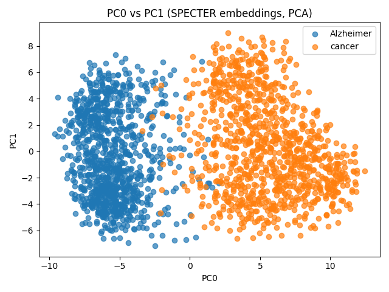

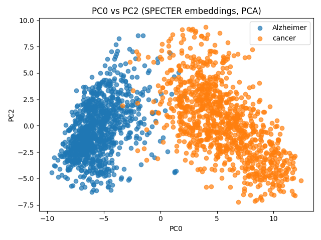

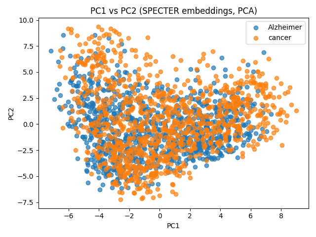

*Comment on the separation or lack thereof, and any take-aways from that.*<br>
- PC0 vs PC1<br>
In this plot, there is a clear separation between Alzheimer’s and cancer papers along the PC0 axis. Most Alzheimer’s papers appear on the left, and most cancer papers on the right, with only a small overlap. This suggests that the main direction of variance (PC0) captures strong topic-level differences between the two groups.

- PC0 vs PC2<br>
A similar pattern is seen in this plot: the two groups remain mostly distinct along PC0, while PC2 adds some variation within each topic. This shows that PC0 is still the primary dimension of separation, and PC2 may represent subtopics variations within each disease area.

- PC1 vs PC2<br>
Here, the two topics overlap considerably. Without PC0, it is much harder to distinguish the two groups. This indicates that PC1 and PC2 mainly capture within-topic diversity rather than overall differences between Alzheimer’s and cancer papers.

Takeaways:<br>
- SPECTER embeddings effectively capture topic information. PCA reveals clear clustering by research area.<br>
- PC0 strongly separates the two disease topics, suggesting the embeddings encode distinct semantic patterns related to each field.<br>
- PC1 and PC2 reflect finer differences (for example, study type or research focus) within each disease group.<br>
- Overall, these findings show that SPECTER embeddings meaningfully organize research papers by topic, and PCA provides an interpretable visualization of this high-dimensional text representation.<br>

### Exercise 3: Computer math vs calculus<br>

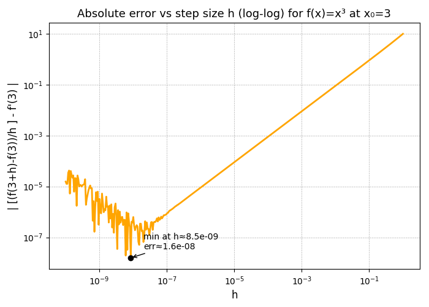

As h becomes smaller, [f(3+h)−f(3)]/h initially gets closer to the true derivative value of 27, and the error decreases. However, after a certain point (around h≈10^−8), the error starts to increase again even though h continues to shrink. Hypothesis: This happens because of round-off error in computer arithmetic. When h is extremely small, f(3+h) and f(3) are almost equal, so subtracting them causes a loss of precision due to limited floating-point accuracy. Dividing this small difference by a tiny h amplifies the rounding error, making the result less accurate. Therefore, as we can see, for moderate h, the approximation improves as expected, but for very small h, floating-point precision limits cause the numerical result to deviate from the true derivative.

### Exercise 4: Health and disease<br>
*Plot the time course of the number of infected individuals until that number drops below 1.*<br>

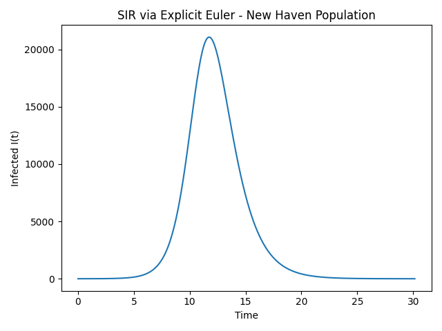

*For those parameter values, when does the number of infected people peak? How many people are infected at the peak?*<br>
Peak time ≈ 11.74 days<br>
Peak infected ≈ 21070 people<br>

*Unfortunately, for new diseases, we may not know beta or gamma with much accuracy. Vary these two variables over "nearby" values, and plot on a heat map how the time of the peak of the infection depends on these two variables.*

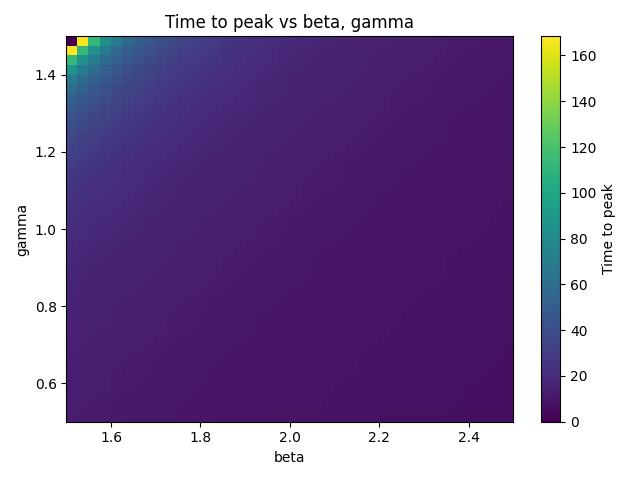

*Do the same for the number of individuals infected at peak.*

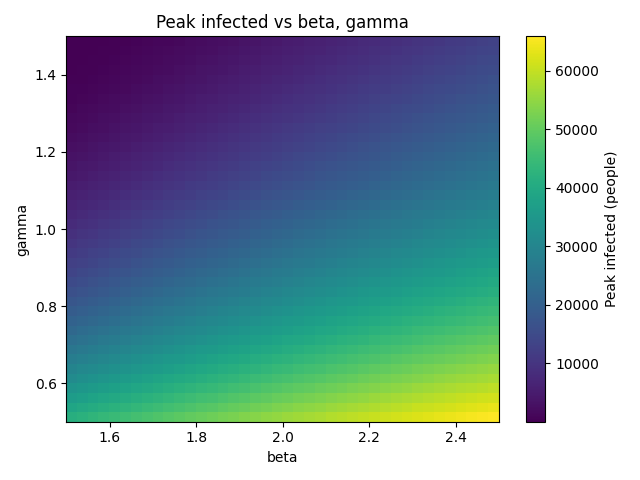

### Exercise 5: Data Exploration for Hospital Readmissions Reduction Program Dataset<br>
*License permitting reuse*<br>
The dataset comes from the Centers for Medicare & Medicaid Services (CMS) Provider Data Catalog:https://data.cms.gov/provider-data/dataset/9n3s-kdb3<br>
According to CMS’s Terms of Use, data posted on data.cms.gov are publicly available and free for reuse with attribution.<br>

*Present a representative set of figures that gives insight into the data. Comment on the insights gained.*

Four figures were created to summarize the Hospital Readmissions Reduction Program (HRRP) dataset from the Centers for Medicare & Medicaid Services.

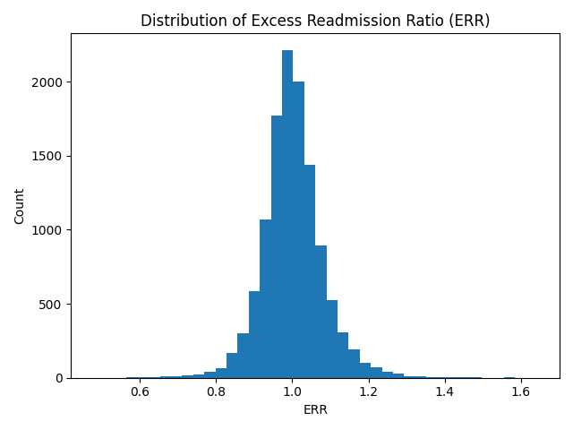

Figure 1 （above）shows the distribution of the Excess Readmission Ratio (ERR) across all hospitals. The values are centered around 1.0, which means most hospitals perform close to the national expectation. A few hospitals have ERR > 1.1, indicating slightly higher-than-expected readmissions.

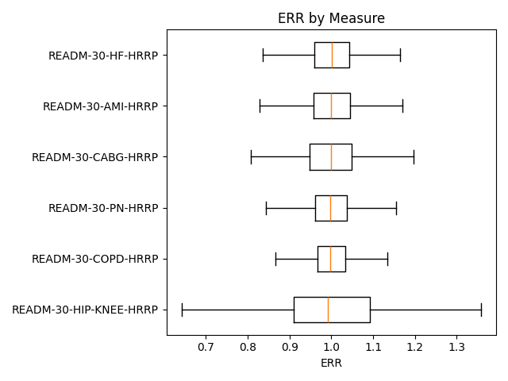

Figure 2 （above）compares ERR values across the six clinical measures (AMI, HF, CABG, COPD, PN, and HIP/KNEE). The medians are close to 1.0 for all measures, but CABG and COPD show a wider spread, suggesting more variation in hospital performance for those conditions.

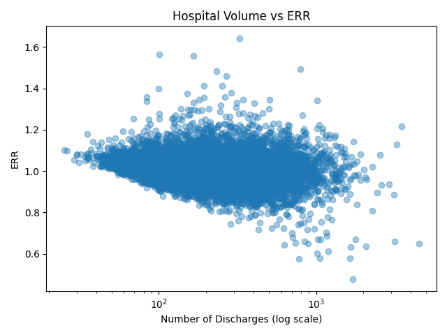

Figure 3 （above）plots the number of discharges (hospital volume) against ERR. The variability in ERR is greater among hospitals with fewer discharges, which is expected because smaller hospitals tend to have more unstable rates. Larger hospitals cluster more tightly around 1.0, showing consistent performance.

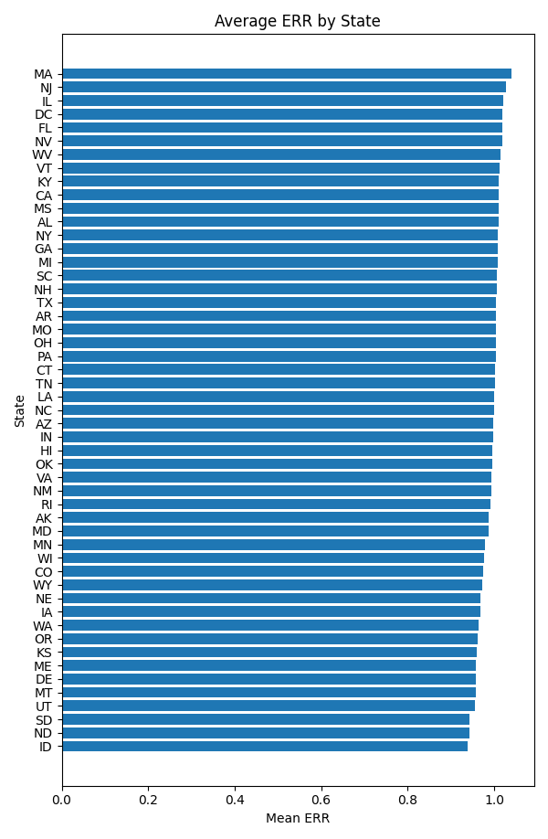

Figure 4 （above）displays the average ERR by state. Most states have mean ERR values near 1.0, indicating that differences across states are modest. This suggests that CMS’s risk-adjustment methods are working to keep state-level comparisons fair.

Overall, these plots show that hospital performance is fairly consistent nationwide, with small differences by condition and hospital size.


*Identify any data cleaning needs (this includes checking for missing data) and write code to perform them. If the data does not need to be cleaned, explain how you reached this conclusion.*

Before analysis, the dataset contained text values such as "N/A" and "Too Few to Report" in numeric columns. These were converted to missing values (NaN) so that calculations could be done correctly. Numeric columns such as Number of Discharges, Excess Readmission Ratio, and Predicted/Expected Readmission Rate were then converted to numeric type. Date columns were also checked and found to be identical for all rows, so they were dropped to simplify the data.

A check for missingness showed that about 35% of rows lacked ERR and related fields, which corresponds to hospitals with too few cases to report. These rows were excluded from numeric summaries and figures. All remaining data were valid, with no duplicates or inconsistent types.

```python
import pandas as pd

na_like = ["N/A", "Too Few to Report", ""]
df = pd.read_csv("FY_2025_Hospital_Readmissions_Reduction_Program_Hospital.csv",
                 na_values=na_like)

num_cols = ["Number of Discharges", "Excess Readmission Ratio",
            "Predicted Readmission Rate", "Expected Readmission Rate",
            "Number of Readmissions"]

for c in num_cols:
    df[c] = pd.to_numeric(df[c], errors="coerce")

df = df.drop(columns=["Start Date", "End Date"])
df_clean = df[df["Excess Readmission Ratio"].notna()]
```
After cleaning, the dataset contained only valid numeric entries and was ready for exploration.


### Code Appendix<br>
```python
#!/usr/bin/env python3
#Exercise 1
import time, json, requests, xml.etree.ElementTree as ET

YEAR  = "2024"
RETMAX = 1000
BATCH  = 200
SLEEP  = 1.0

EUTILS = "https://eutils.ncbi.nlm.nih.gov/entrez/eutils"
ESEARCH = f"{EUTILS}/esearch.fcgi"
EFETCH  = f"{EUTILS}/efetch.fcgi"

def text_content(elem):
    """extract plain text"""
    if elem is None:
        return ""
    return ET.tostring(elem, method="text", encoding="unicode").strip()

# 1a) ESearch - retrieve PMIDs
def esearch_pmids(term_tiab, year=YEAR, retmax=RETMAX):
    params = {
        "db": "pubmed",
        "term": term_tiab,
        "retmode": "xml",
        "retmax": str(retmax),
        "datetype": "pdat",
        "mindate": year,
        "maxdate": year
    }

    r = requests.get(ESEARCH, params=params, timeout=60)
    r.raise_for_status()
    root = ET.fromstring(r.text)
    return [e.text for e in root.findall(".//IdList/Id")]

# 1b/d) EFetch metadata in batches (handle structured abstracts)
def efetch_metadata(pmids, query_label):
    """
    Returns {pmid: {"ArticleTitle": ..., "AbstractText": ..., "query": ...}}
    """
    out = {}
    for i in range(0, len(pmids), BATCH):
        ids = ",".join(pmids[i:i+BATCH])
        data = {
            "db": "pubmed",
            "id": ids,
            "retmode": "xml",
            "rettype": "abstract"
        }
        resp = requests.post(EFETCH, data=data, timeout=120)
        resp.raise_for_status()
        root = ET.fromstring(resp.text)

        for art in root.findall(".//PubmedArticle"):
            pmid = (art.findtext(".//MedlineCitation/PMID") or "").strip()
            if not pmid:
                continue

            title = text_content(art.find(".//Article/ArticleTitle"))

            # structured abstracts: join all sections
            parts = []
            for p in art.findall(".//Article/Abstract/AbstractText"):
                label = p.attrib.get("Label")
                txt = text_content(p)
                if txt:
                    parts.append(f"{label}: {txt}" if label else txt)
            abstract = " ".join(parts)

            out[pmid] = {
                "ArticleTitle": title,
                "AbstractText": abstract,
                "query": query_label
            }
        time.sleep(SLEEP)  # rate limit
    return out

# 1c) Overlap
def compute_overlap(pmids_a, pmids_b):
    return sorted(set(pmids_a) & set(pmids_b), key=int)

# Main execution
def main():
    # 1(a) ESearch
    alz_pmids = esearch_pmids("Alzheimers+AND+2024[pdat]")
    time.sleep(SLEEP)
    can_pmids = esearch_pmids("cancer+AND+2024[pdat]")
    time.sleep(SLEEP)

    # 1(b)+ 1(d) EFetch metadata (batched; handle structured abstracts)
    alz_meta = efetch_metadata(alz_pmids, "Alzheimer")
    can_meta = efetch_metadata(can_pmids, "cancer")

    # Save JSON outputs
    with open("alzheimers_2024_metadata.json", "w", encoding="utf-8") as f:
        json.dump(alz_meta, f, ensure_ascii=False, indent=2)
    with open("cancer_2024_metadata.json", "w", encoding="utf-8") as f:
        json.dump(can_meta, f, ensure_ascii=False, indent=2)

    # 1(c) Overlap
    overlap = compute_overlap(alz_pmids, can_pmids)
    with open("overlap_pmids.txt", "w", encoding="utf-8") as f:
        f.write("\n".join(overlap))
    
    # Summary
    print(f"Alzheimer PMIDs: {len(alz_pmids)}; Cancer PMIDs: {len(can_pmids)}")
    print(f"Metadata: {len(alz_meta)} Alz; {len(can_meta)} Cancer")
    print(f"Overlap PMIDs: {len(overlap)}")

if __name__ == "__main__":
    main()

#Exercise 2
import json
from pathlib import Path

import numpy as np
import pandas as pd
import tqdm
import matplotlib.pyplot as plt

import torch
from transformers import AutoTokenizer, AutoModel
from sklearn.decomposition import PCA

# load model and tokenizer
tokenizer = AutoTokenizer.from_pretrained('allenai/specter')
model = AutoModel.from_pretrained('allenai/specter')

# load papers from Exercise 1 outputs
ALZ_JSON = Path("alzheimers_2024_metadata.json")
CAN_JSON = Path("cancer_2024_metadata.json")

with ALZ_JSON.open("r", encoding="utf-8") as f:
    alz_meta = json.load(f)
with CAN_JSON.open("r", encoding="utf-8") as f:
    can_meta = json.load(f)

# merge into one dict; keep order stable by sorting PMIDs numerically
def sort_by_pmid(d):
    def _k(x):
        try:
            return int(x)
        except:
            return x
    return dict(sorted(d.items(), key=lambda kv: _k(kv[0])))

alz_meta = sort_by_pmid(alz_meta)
can_meta = sort_by_pmid(can_meta)

papers = {}
papers.update(alz_meta)
papers.update(can_meta)

print(f"Total papers loaded: {len(papers)}  (Alz: {len(alz_meta)}, Cancer: {len(can_meta)})")

# get_abstract 
def get_abstract(paper: dict) -> str:
    txt = paper.get("AbstractText", "")
    if txt is None:
        return ""
    if isinstance(txt, list):
        return " ".join([t for t in txt if t])
    return str(txt)

# compute embeddings
pmids_in_order = list(papers.keys())
embeddings = []

for pmid in tqdm.tqdm(pmids_in_order, desc="Embedding papers"):
    paper = papers[pmid]
    text = (paper.get("ArticleTitle", "") or "") + tokenizer.sep_token + get_abstract(paper)

    inputs = tokenizer(
        text,
        padding=True,
        truncation=True,
        return_tensors="pt",
        max_length=512
    )

    with torch.no_grad():
        outputs = model(**inputs)
        vec = outputs.last_hidden_state[:, 0, :].cpu().numpy()[0]  
        embeddings.append(vec)

embeddings = np.vstack(embeddings)  

# PCA to 3 components 
pca = PCA(n_components=3, random_state=0)
emb3 = pca.fit_transform(embeddings)

# build a dataframe with labels for plotting
labels = [papers[pmid].get("query", "") for pmid in pmids_in_order]
df = pd.DataFrame(emb3, columns=["PC0", "PC1", "PC2"])
df["query"] = labels

print("Explained variance ratios:", pca.explained_variance_ratio_)

# 2D scatter plots
pairs = [("PC0", "PC1"), ("PC0", "PC2"), ("PC1", "PC2")]
for x, y in pairs:
    plt.figure()
    for label in sorted(set(labels)):
        subset = df[df["query"] == label]
        plt.scatter(subset[x], subset[y], label=label, alpha=0.7)
    plt.xlabel(x)
    plt.ylabel(y)
    plt.legend()
    plt.title(f"{x} vs {y} (SPECTER embeddings, PCA)")
    plt.tight_layout()
    plt.show()

#Exercise 3
import numpy as np
import matplotlib.pyplot as plt

# define the function and its true derivative
def f(x):
    return x**3

x0 = 3.0
true_deriv = 3 * x0**2  

# step sizes h from 10^-10 to 1 (log spaced)
h = np.logspace(-10, 0, 400)

# approximation of derivative
cal_deriv = (f(x0 + h) - f(x0)) / h

# absolute error 
abs_err = np.abs(cal_deriv - true_deriv)

# find h with minimum error
min_idx = np.nanargmin(abs_err)
h_star = h[min_idx]
err_star = abs_err[min_idx]

# log-log graph
plt.figure(figsize=(7, 5))
plt.loglog(h, abs_err, linewidth=2, color='orange')
plt.xlabel("h", fontsize=12)
plt.ylabel("| [(f(3+h)-f(3))/h ] - f'(3) |", fontsize=12)
plt.title("Absolute error vs step size h (log-log) for f(x)=x³ at x₀=3", fontsize=13)

# highlight the minimum error point
plt.scatter(h_star, err_star, color='black', zorder=5)
plt.annotate(f"min at h≈{h_star:.1e}\nerr≈{err_star:.1e}",
             (h_star, err_star),
             textcoords="offset points", xytext=(15, 10),
             fontsize=10, arrowprops=dict(arrowstyle="->", lw=1))

plt.grid(True, which="both", ls="--", lw=0.5)
plt.tight_layout()
plt.show()

print(f"Minimum error occurs at h ≈ {h_star:.2e}, error ≈ {err_star:.2e}")

#Exercise 4
import numpy as np
import matplotlib.pyplot as plt

def euler_sir(S0, I0, R0, beta, gamma, dt=0.01, Tmax=365.0, stop_when_I_below=None):
    N = S0 + I0 + R0
    steps = int(Tmax / dt) + 1

    t = [0.0]
    S = [float(S0)]
    I = [float(I0)]
    R = [float(R0)]
    peaked = False

    for _ in range(steps - 1):
        s, i, r = S[-1], I[-1], R[-1]
        dS = -beta * s * i / N
        dI =  beta * s * i / N - gamma * i
        dR =  gamma * i

        S.append(s + dt * dS)
        I.append(i + dt * dI)
        R.append(r + dt * dR)
        t.append(t[-1] + dt)

        if len(I) >= 3 and (I[-2] >= I[-3]) and (I[-2] > I[-1]):
            peaked = True
        if stop_when_I_below is not None and peaked and I[-1] < stop_when_I_below:
            break

    return np.array(t), np.array(S), np.array(I), np.array(R)

# Parameters
N = 137000
I0, R0 = 1.0, 0.0
S0 = N - I0 - R0
beta, gamma = 2.0, 1.0
dt = 0.01

# Integrate and plot
t, S, I, R = euler_sir(S0, I0, R0, beta, gamma, dt=dt, Tmax=365.0, stop_when_I_below=1.0)

plt.figure()
plt.plot(t, I)
plt.xlabel("Time")
plt.ylabel("Infected I(t)")
plt.title("SIR via Explicit Euler - New Haven Population")
plt.tight_layout()
plt.show()

def peak_stats(t, I):
    idx = int(np.argmax(I))
    return float(t[idx]), float(I[idx])

t_peak, I_peak = peak_stats(t, I)
print(f"Peak time: {t_peak:.2f}")
print(f"Infected at peak: {I_peak:.0f}")

# beta and gamma ranges nearby
beta_vals  = np.linspace(1.5, 2.5, 40)
gamma_vals = np.linspace(0.5, 1.5, 40)

def sweep_beta_gamma(S0, I0, R0, beta_vals, gamma_vals, dt=0.02, Tmax=365.0):
    time_to_peak = np.full((len(gamma_vals), len(beta_vals)), np.nan)
    infected_at_peak = np.full((len(gamma_vals), len(beta_vals)), np.nan)
    for gi, g in enumerate(gamma_vals):
        for bi, b in enumerate(beta_vals):
            t_, S_, I_, R_ = euler_sir(S0, I0, R0, b, g, dt=dt, Tmax=Tmax, stop_when_I_below=1.0)
            p = int(np.argmax(I_))
            time_to_peak[gi, bi] = float(t_[p])
            infected_at_peak[gi, bi] = float(I_[p])
    return time_to_peak, infected_at_peak

time_to_peak, infected_at_peak = sweep_beta_gamma(S0, I0, R0, beta_vals, gamma_vals, dt=0.02)

plt.figure()
plt.imshow(time_to_peak, origin="lower",
           extent=[beta_vals[0], beta_vals[-1], gamma_vals[0], gamma_vals[-1]],
           aspect="auto")
plt.colorbar(label="Time to peak")
plt.xlabel("beta")
plt.ylabel("gamma")
plt.title("Time to peak vs beta, gamma")
plt.tight_layout()
plt.show()

# vary number of individuals infected at peak
plt.figure()
plt.imshow(infected_at_peak, origin="lower",
           extent=[beta_vals[0], beta_vals[-1], gamma_vals[0], gamma_vals[-1]],
           aspect="auto")
plt.colorbar(label="Peak infected (people)")
plt.xlabel("beta"); plt.ylabel("gamma")
plt.title("Peak infected vs beta, gamma")
plt.tight_layout(); plt.show()

#Exercise 5
import os
import numpy as np
import pandas as pd
import matplotlib.pyplot as plt

CSV_PATH = "FY_2025_Hospital_Readmissions_Reduction_Program_Hospital.csv"  # <- change if needed

na_like = ["N/A", "Too Few to Report", ""]
df = pd.read_csv(CSV_PATH, na_values=na_like)
print(df.head(3))
print(df.shape)

rename_map = {
    "Facility Name": "facility_name",
    "Facility ID": "facility_id",
    "State": "state",
    "Measure Name": "measure_name",
    "Number of Discharges": "discharges",
    "Footnote": "footnote",
    "Excess Readmission Ratio": "excess_readm_ratio",
    "Predicted Readmission Rate": "pred_readm_rate",
    "Expected Readmission Rate": "exp_readm_rate",
    "Number of Readmissions": "num_readmissions",
    "Start Date": "start_date",
    "End Date": "end_date",
}
df = df.rename(columns=rename_map)

# numeric conversions 
num_cols = ["discharges", "excess_readm_ratio", "pred_readm_rate",
            "exp_readm_rate", "num_readmissions"]
for c in num_cols:
    df[c] = pd.to_numeric(df[c], errors="coerce")

# dates 
for c in ["start_date", "end_date"]:
    if c in df.columns:
        df[c] = pd.to_datetime(df[c], errors="coerce", format="%m/%d/%Y")

# drop constant date columns 
for c in ["start_date", "end_date"]:
    if c in df.columns and df[c].nunique(dropna=False) <= 1:
        df = df.drop(columns=[c])

print("\nMissing by column:")
print(df.isna().sum().sort_values(ascending=False))

print("\nData types:")
print(df.dtypes)

print("\nQuick numeric summaries:")
print(df[num_cols].describe())

# how many rows have observed ERR (excess_readm_ratio)?
n_total = len(df)
n_err = df["excess_readm_ratio"].notna().sum()
print(f"\nRows with ERR present: {n_err} / {n_total} ({n_err/n_total:.1%})")

# duplicates check (facility_id + measure_name should be unique)
dup_mask = df.duplicated(subset=["facility_id", "measure_name"], keep=False)
print(f"Potential duplicates on (facility_id, measure_name): {dup_mask.sum()}")

df_clean = df.copy()
df_clean = df_clean[df_clean["excess_readm_ratio"].notna()].copy()

os.makedirs("figs", exist_ok=True)

# Figure 1: Histogram of Excess Readmission Ratio (overall)
plt.figure()
df_clean["excess_readm_ratio"].plot.hist(bins=40)
plt.title("Distribution of Excess Readmission Ratio (ERR)")
plt.xlabel("ERR")
plt.ylabel("Count")
plt.tight_layout()
plt.savefig("figs/fig1_err_hist.png"); plt.close()

# Figure 2: Boxplot of ERR by measure
plt.figure()
# sort measures by median ERR for nicer order
order = (df_clean.groupby("measure_name")["excess_readm_ratio"]
         .median().sort_values().index.tolist())
data_by_measure = [df_clean.loc[df_clean["measure_name"]==m, "excess_readm_ratio"] for m in order]
plt.boxplot(data_by_measure, vert=False, labels=order, showfliers=False)
plt.title("ERR by Measure")
plt.xlabel("ERR")
plt.tight_layout()
plt.savefig("figs/fig2_err_by_measure.png"); plt.close()

# Figure 3: Volume vs ERR (log x-axis)
plt.figure()
plt.scatter(df_vol["discharges"], df_vol["excess_readm_ratio"], alpha=0.4)
plt.xscale("log")
plt.title("Hospital Volume vs ERR")
plt.xlabel("Number of Discharges (log scale)")
plt.ylabel("ERR")
plt.tight_layout()
plt.savefig("figs/fig3_volume_vs_err.png"); plt.close()

# Figure 4: Average ERR by state (bar chart)
state_mean = (df_clean.groupby("state", dropna=False)["excess_readm_ratio"]
              .mean().sort_values())
plt.figure(figsize=(6, max(4, len(state_mean)*0.18)))
plt.barh(state_mean.index.astype(str), state_mean.values)
plt.title("Average ERR by State")
plt.xlabel("Mean ERR"); plt.ylabel("State")
plt.tight_layout()
plt.savefig("figs/fig4_state_mean_err.png"); plt.close()


