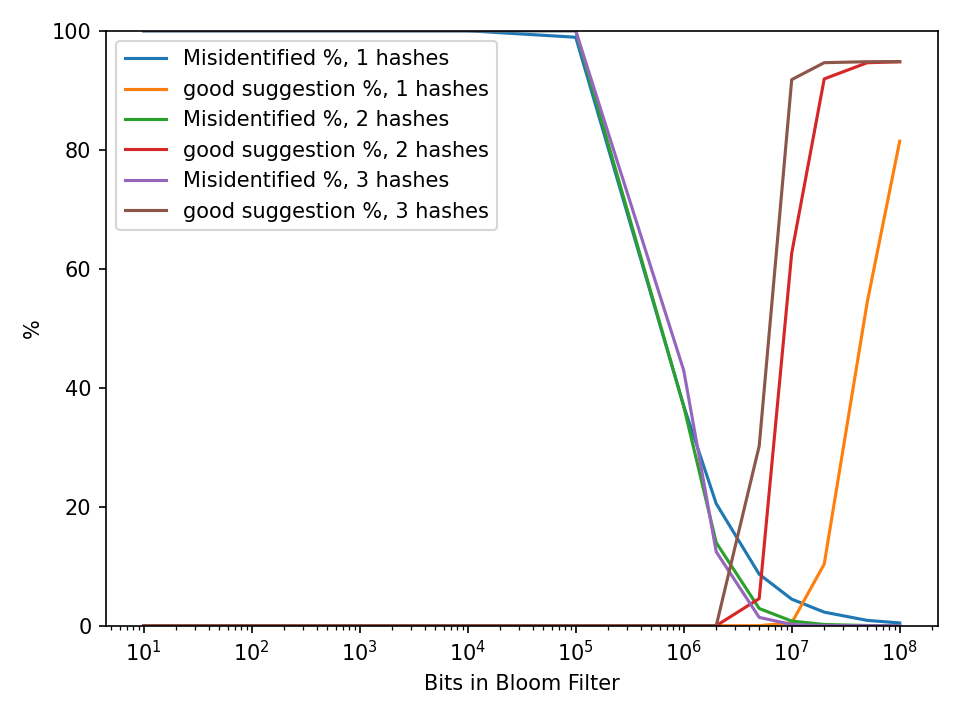
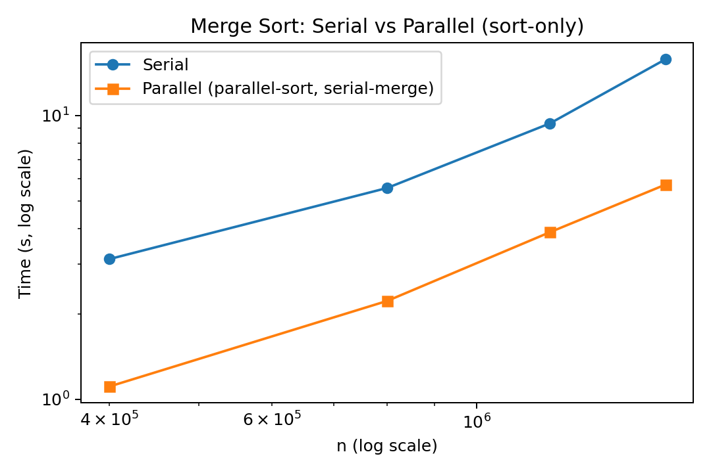

# Problem Set 2
**Name:** Yu (Irene) Wang<br>
**NetID:** yw2247        <br>
## Instructions to Run Code
- Python 3.x required  
- Install dependencies:  
  ```bash
  pip install bitarray matplotlib biopython numpy

### Exercise 1: Spelling Correction Using a Bloom Filter
**1a. Implementing and Populate a Bloom Filter**<br> 
*Create a Bloom Filter*<br> 
*Insert Words into the Bloom Filter*<br> 
Code Appendix. <br> 

**1a. 1b. Spell Check and Correction**<br> 
*Implement a Spelling Correction Function*<br> 
*Evaluate Performance*<br> 
The Bloom filter was tested using the typos.json file with 25000 typo pairs and a filter size of 10^7 bits. The number of hash functions was varied to see how it affected performance.<br>

| # of Hash Functions | Good Suggestion Rate | Misidentified Rate |
| ------------------- | -------------------- | ------------------ |
| 1                   | 0.48 %               | 4.46 %             |
| 2                   | 62.6 %               | 0.78 %             |
| 3                   | 91.8 %               | 0.20 %             |

Using only one hash function gave many false positives and poor accuracy. With two hash functions, the results improved, and with three, the Bloom filter reached about 92% correct suggestions while keeping false positives very low (0.2%).<br>

**1c. Analysis and Reflection**<br> 
*Plot the Effect of Filter Size and Number of Hash Functions*<br>



*Approximately how many bits are necessary to achieve 85% good suggestions with each combination of 1, 2, or 3 hash functions?*<br>

| k (hashes) |                     Bits needed | Approx. memory |
| ---------- | ------------------------------: | -------------: |
| 1          | *Not reached* (in tested range) |              — |
| 2          |                 20,000,000 bits |        ~2.5 MB |
| 3          |                 10,000,000 bits |       ~1.25 MB |

### Exercise 2: Accelerating data processing with parallel programming
**2a. Modify alg2 for Keyed Sorting**<br>
*Adapt the alg2 merge sort to sort based on a key-value relationship.*<br>
*Provide examples demonstrating that your code works. Be clear how you know that it works.*<br>
Original data: <br>
{'patient_id': 3, 'name': 'Charlie', 'age': 40}<br>
{'patient_id': 1, 'name': 'Alice', 'age': 22}<br> 
{'patient_id': 2, 'name': 'Bob', 'age': 31} <br>
{'patient_id': 2, 'name': 'Bella', 'age': 29} <br>
{'patient_id': 9, 'name': 'Tommy', 'age': 1} <br>

Sorted data (by patient_id):
{'patient_id': 1, 'name': 'Alice', 'age': 22} <br>
{'patient_id': 2, 'name': 'Bob', 'age': 31} <br>
{'patient_id': 2, 'name': 'Bella', 'age': 29} <br>
{'patient_id': 3, 'name': 'Charlie', 'age': 40} <br>
{'patient_id': 9, 'name': 'Tommy', 'age': 1}<br>

We know the function works because: <br>
1. The output is in the correct order.<br>
The patient_ids in the sorted list go from 1 -> 2 -> 2 -> 3 -> 9, which is ascending order, so the sorting logic is correct.<br>
2. All patients are still there.<br>
Every record from the original list appears once in the sorted list, so no one is lost or duplicated.<br>
3. The data stays matched with each patient.<br>
For example, "Charlie" still has age 40, and "Alice" still has age 22, so each patient’s information stayed aligned with their patient_id.<br>
4. Tied IDs keep their original order. <br>
For the two patients with patient_id = 2, the output keeps "Bob" before "Bella", just like in the input, so the algorithm correctly keeps the original order for equal keys.<br>


**2b. Parallelize the Algorithm**
*Measure and compare the performance of your parallel algorithm with the original serial version.*<br>
n=  400000 | serial=  2.982s | parallel=  1.309s | speedup=2.28x <br>
n=  800000 | serial=  5.195s | parallel=  1.986s | speedup=2.62x <br>
n= 1200000 | serial=  9.898s | parallel=  4.022s | speedup=2.46x <br>
n= 1600000 | serial= 13.257s | parallel=  4.828s | speedup=2.75x <br>

Implementation of the Parallel Version:<br>
- Step 1 - Split the data:<br>
Divided the list of patient records into a few large chunks (about one per CPU core). Each chunk contains thousands of records that can be sorted independently.<br>
- Step 2 - Sort chunks in parallel:<br>
Used Python’s multiprocessing.Pool, which starts several worker processes. Each worker receives one chunk of data and sorts it by patient_id. Since the workers run on different CPU cores, the sorting happens simultaneously.<br>
- Step 3 - Merge the results:<br>
After all workers finish sorting their chunks, the main process collects the sorted parts and merges them into one final sorted list. Merging is much faster than sorting, so it was only done once at the end.
- Step 4 - Compare performance:<br>
Used time.perf_counter() to measure how long the serial and parallel versions take on the same datasets. As the data size grows, the parallel version consistently finishes in less time because multiple cores share the workload.<br>

*Visualize the results: Use a log-log plot to compare the time complexity of the parallel and serial versions.*



### Exercise 3: Estimating the Number of Distinct 15-mers in Chromosome 1 using Hash Functions
**3a. Parsing and k-mer generation**<br> 
*How many nucleotides are in Chromosome 1?*<br>
There are 249250621 nucleotides in Chromosome 1. <br>

*Exclude any 15-mer that contains more than two Ns. Count how many valid 15-mers you generate.*<br>
I generated 225280241 valid 15-mers. <br>

**3b. Implementing a hash family**<br> 
Code Appendix. 

**3c. Estimating distinct counts**<br> 
t= number of hash functions
t=   1  mean(min/M)=5.672346e-09  estimate distinct counts≈176,293,902<br> 
t=   2  mean(min/M)=3.303725e-09  estimate distinct counts≈302,688,644<br> 
t=   5  mean(min/M)=2.849762e-09  estimate distinct counts≈350,906,525<br> 
t=  10  mean(min/M)=3.327625e-09  estimate distinct counts≈300,514,665<br> 
t= 100  mean(min/M)=3.855155e-09  estimate distinct counts≈259,392,924<br> 

**3d. Evaluation and analysis**<br>
*Plot the estimated distinct count against the true number of distinct 15-mers for varying numbers of hash functions.*


*Discuss how the estimate improves as more hash functions are combined.*<br>
When more hash functions are used, the estimate usually becomes closer to the true count. Each hash provides an independent sample of the data, and combining them reduces random error. In my results, the smaller number of hashes happened to give a value closer to the true count by luck, but generally, using more hashes gives a more accurate overall estimate

*How stable are the estimates? What happens if you only use a single hash?*<br>
The estimates become more stable and consistent as the number of hashes increases. With only one or two hashes, the results can vary a lot between runs because a single random hash may strongly influence the outcome. A single hash can give very different estimates each time, while using many hashes produces results that are much more repeatable.

**3e. Justification of design choices**<br>
*How you selected values for a.*
Each hash function uses a different random base value a to create independent hashes. I randomly chose distinct odd integers smaller than the large prime modulus M = 2^61-1. Using odd and distinct values helps avoid collisions and makes the hash functions behave more independently. I also used a fixed random seed to keep results reproducible.

*Any optimizations you made (e.g., rolling updates, pre-encoding).*
As instructed in the assignment, I used a rolling hash update so that each new k-mer’s hash could be computed in O(1) time by reusing the previous hash instead of recalculating it from scratch. I also pre-encoded the DNA sequence by mapping each character (A, C, G, T, N, X) to numbers (1–6) before hashing, which speeds up the computation. I also vectorized the hash calculations with NumPy so all hash functions update together, which greatly reduces runtime on the full chromosome.

### Exercise 4: Thinking about health and the Internet
**4A: Research and Analysis (451 words)**<br> 
New forms of online health care, such as telemedicine, health apps, and wearable devices, have increased how we receive health information and care; however, at the same time, they’ve created new challenges around questions of fairness, privacy, accuracy, and legal rules. We need to understand these challenges to ensure that digital health continues to improve access to care for all people, rather than widening inequalities.

First, digital health tools are not equally accessible. Many people do not have fast internet access or the skills to use digital tools (Saeed, 2021). In particular, rural, low-income, and older populations may lack access to the internet or the technology needed to use online health care (Cuadros, 2023). Many communities that face barriers to health care also live in areas with poor broadband access (Cuadros, 2023). In addition, some cultural groups, such as the Amish, intentionally restrict internet access to maintain community values and avoid outside influence (Ems, 2022). Because of these differences, digital health tools cannot reach everyone equally.

Protecting patient information becomes a second concern when healthcare moves online. Healthcare providers must follow laws around patient privacy, such as HIPAA, and keep patient information safe from hackers or data leaks (Tazi, 2023). Many people also wonder about how health apps or wearable technology keep their data safe (Sifaoui, 2022). Moreover, if a device gives incorrect readings or a system fails, it can generate huge confusion and harm. Therefore, to be trusted, digital health must be both secure and reliable.

The internet makes it easy for people to access health information; however, not all the information is true. The false or misleading contents can be spread quickly online, especially through social media or health apps that are not regulated (Sathianathan, 2025). People with low health literacy may struggle to distinguish accurate information from misinformation, which can cause incorrect self-diagnosis and unsafe use of health products. Increasing public education and promoting trusted health sources are important steps to reducing these risks.

Finally, online health care often involves patients and doctors in different locations, which makes licensing very complicated. In the United States, doctors must be licensed in the state where the patient lives, which limits offering telehealth across state lines. Different states have different laws around prescribing online, insurance coverage, and patient consent, which can also make it difficult for doctors to provide care across state lines and slow down the wider use of telehealth.

We can see that a lot of challenges like unequal internet access, privacy risks, misinformation, and complex legal rules exist. Nonetheless, I believe that healthcare systems can still make digital health more equitable, safer, and more effective for all by enhancing digital infrastructure, protecting privacy, teaching users, and updating laws.

Reference:<br>
Saeed, S. A., & Masters, R. M. (2021). *Disparities in health care and the digital divide.* Current Psychiatry Reports, 23(9), 61. https://doi.org/10.1007/s11920-021-01274-4

Cuadros, D. F., Moreno, C. M., Miller, F. D., Omori, R., & MacKinnon, N. J. (2023). *Assessing access to digital services in health care–underserved communities in the United States: A cross-sectional study.* Mayo Clinic Proceedings: Digital Health, 1(3), 100030. https://doi.org/10.1016/j.mcpdig.2023.04.004

Ems, L. (2022). *Virtually Amish: Preserving community at the internet’s margins.* MIT Press. https://doi.org/10.7551/mitpress/11792.001.0001

Tazi, F., Nandakumar, A., Dykstra, J., Rajivan, P., & Das, S. (2023). *Privacy, security, and usability tradeoffs of telehealth from practitioners’ perspectives.* arXiv preprint arXiv:2306.05725. https://doi.org/10.48550/arXiv.2306.05725

Sifaoui, A., & Eastin, M. S. (2024). *“Whispers from the wrist”: Wearable health monitoring devices and privacy regulations in the U.S.—The loopholes, the challenges, and the opportunities.* Cryptography, 8(2), 26. https://doi.org/10.3390/cryptography8020026

Sathianathan, S., Mhd Ali, A., & Chong, W. W. (2025). *How the general public navigates health misinformation on social media: Qualitative study of identification and response approaches.* JMIR Infodemiology, 5(1), e67464. https://doi.org/10.2196/67464

**4B: Personal Connection (163 words)**<br> 
I’ve been using an Apple Watch for 4 years and over time it has become something I rely on. I initially purchased it to simply be able to check messages or calls, but I started using it more for health tracking. Now it helps me monitor my sleep, period, weight, as well as exercises like running, swimming, and gym workouts. For example, I like that it automatically records my heartbeat, pace, etc. so that I can know my workout performance, which keeps me motivated to stay active. My only concerns are if my data are private and the cost of buying a new device if the current one is broken. Despite these, using apple watch has made me more aware of how much I’m moving on a day-to-day basis and my basic health conditions. It also makes me feel more physically ‘in control’ and encouraged in ways that may not show up in research studies but feels very real in my everyday life.

**4C: Meta-Reflection (148 words)**<br> 
I think the most challenging part of this assignment was finding credible sources that I could accurately understand and use. When I initially started researching digital health, I came across so many articles and blogs that seemed legit but didn’t have clear evidence or citations. Additionally, some academic articles were too long or contained a lot of policies and statistics besides the main point that I wanted to focus on, so I wasn’t sure how to pull out what really mattered for my argument. It was also difficult to cover so many different topics at once, so we had to do research separately and piece together information from many sources to see the bigger picture. Although it was very time consuming, from this searching process, I realized that it is very important to think critically and holistically about what I read online to prove the point of views.

### Exercise 5: Discover data
Dataset: Hospital Readmissions Reduction Program (HRRP)<br> 
The dataset from the Centers for Medicare & Medicaid Services (CMS) reports how U.S. hospitals perform under the Hospital Readmissions Reduction Program (HRRP). It includes each hospital’s 30-day readmission rates for conditions such as heart failure, pneumonia, and COPD, as well as an Excess Readmission Ratio (ERR) that compares a hospital’s readmission performance with the national average. Hospitals with higher-than-expected readmissions may receive payment reductions from Medicare.

The data was obtained from the official CMS open data portal: data.cms.gov. It follows the U.S. Government Open Data Policy, which allows free reuse and analysis for research or educational purposes.

This dataset is interesting because it shows how hospital performance and patient outcomes are linked to real financial results. The data helps identify which hospitals have higher readmission rates, how their performance changes over time, and what factors may affect patient care. It also matters for public health, since lowering unnecessary readmissions can reduce costs and improve the quality of care.

Two potential questions to explore:
1. How do hospitals’ readmission rates and penalties vary by state or hospital type?
2. What factors are linked to higher Excess Readmission Ratios across hospitals?


## Appendix: Full Code
```python
# -----------------------
# Exercise 1
# -----------------------
from bitarray import bitarray
from hashlib import sha3_256, sha256, blake2b
import string
import json
import matplotlib.pyplot as plt

# 1a. Implementing and Populate a Bloom Filter
# set the Bloom filter size (in bits)
size = int(1e7)    # about 1.25 MB
# implement the filter
bloom = bitarray(size)
bloom.setall(False)

def my_hash(s):
    return int(sha256(s.lower().encode()).hexdigest(), 16) % size

def my_hash2(s):
    return int(blake2b(s.lower().encode()).hexdigest(), 16) % size

def my_hash3(s):
    return int(sha3_256(s.lower().encode()).hexdigest(), 16) % size

with open("data/words.txt", "r", encoding="utf-8") as f:
    for line in f:
        word = line.strip()
        # check whether the current word is empty
        if not word:
            continue
        # compute indices for each hash and set those bits
        idx1 = my_hash(word)
        idx2 = my_hash2(word)
        idx3 = my_hash3(word)
        bloom[idx1] = True
        bloom[idx2] = True
        bloom[idx3] = True

# 1b. Spell Check and Correction
alphabet = string.ascii_lowercase

def bf_contains(word, bloom, hash_funcs):
    w = word.lower()
    return all(bloom[h(w)] for h in hash_funcs)

def spell_check(word, bloom, hash_funcs, alphabet=alphabet):
    word = word.lower()
    suggestions, seen = [], set()
    for i, ch0 in enumerate(word):
        for ch in alphabet:
            if ch == ch0:
                continue
            cand = word[:i] + ch + word[i+1:]
            if cand in seen:
                continue
            seen.add(cand)
            if all(bloom[h(cand)] for h in hash_funcs):
                suggestions.append(cand)
    return suggestions

dict_words = {
    line.strip().lower()
    for line in open("data/words.txt", encoding="utf-8")
    if line.strip()
}

def evaluate(bloom, typos_path, hash_funcs, dict_words):
    with open(typos_path, 'r', encoding='utf-8') as f:
        typo_pairs = json.load(f)

    total_typos = 0
    good_suggestions = 0
    misidentified = 0
    max_suggestions=3

    for typed_word, correct_word in typo_pairs:
        typed_word = typed_word.lower()
        correct_word = correct_word.lower()

        if typed_word == correct_word:
            continue

        total_typos += 1

        # misidentified (fp): BF claims typed_word is present, but it's not in the true dictionary
        if typed_word not in dict_words and bf_contains(typed_word, bloom, hash_funcs):
            misidentified += 1

        # good suggestion: ≤3 suggestions and includes the correct word
        suggestions = spell_check(typed_word, bloom, hash_funcs)
        if len(suggestions) <= max_suggestions and correct_word in suggestions:
            good_suggestions += 1

    if total_typos == 0:
        return {"good_rate": 0.0, "misidentified_rate": 0.0, "n_typos": 0}

    return {
        "good_rate": good_suggestions / total_typos,
        "misidentified_rate": misidentified / total_typos,
        "n_typos": total_typos,
    }

  def build_bloom(dict_words, size_bits, hash_funcs):
    b = bitarray(size_bits); b.setall(False)
    for w in dict_words:
        for h in hash_funcs:
            b[h(w)] = True
    return b

hash_funcs1 = [my_hash]
hash_funcs2 = [my_hash, my_hash2]
hash_funcs3 = [my_hash, my_hash2, my_hash3]

# Evaluate Performance
bloom1 = build_bloom(dict_words, size, hash_funcs1)
eval1  = evaluate(bloom1, "data/typos.json", hash_funcs1, dict_words)

bloom2 = build_bloom(dict_words, size, hash_funcs2)
eval2  = evaluate(bloom2, "data/typos.json", hash_funcs2, dict_words)

bloom3 = build_bloom(dict_words, size, hash_funcs3)
eval3  = evaluate(bloom3, "data/typos.json", hash_funcs3, dict_words)

print(eval1, eval2, eval3)

# 1c. Analysis and Reflection 
sizes = [int(1e1), int(1e2), int(1e3), int(1e4), int(1e5), int(1e6), int(2e6), int(5e6), int(1e7), int(2e7), int(5e7), int(1e8)]
hashsets = {
    1: [my_hash],
    2: [my_hash, my_hash2],
    3: [my_hash, my_hash2, my_hash3],
}

results = {k: [] for k in (1, 2, 3)}
for k, funcs in hashsets.items():
    for m in sizes:
        size = m                      # update the global used inside my_hash
        b = build_bloom(dict_words, m, funcs)
        s = evaluate(b, "data/typos.json", funcs, dict_words)
        results[k].append({"m": m, "good": 100*s["good_rate"], "misid": 100*s["misidentified_rate"]})
        print(f"k={k}, m={m:,}: good={s['good_rate']:.3f}, misid={s['misidentified_rate']:.3f}")

# thresholds
for k in (1, 2, 3):
    rows = sorted(results[k], key=lambda r: r["m"])
    hit = next((r["m"] for r in rows if r["good"] >= 85.0), None)
    print(f"k={k} bits for ≥85% good: {hit if hit is not None else 'not reached'}")

# plots
plt.figure()
for k in (1, 2, 3):
    rows = sorted(results[k], key=lambda r: r["m"])
    xs = [r["m"] for r in rows]
    plt.plot(xs, [r["misid"] for r in rows], label=f"Misidentified %, {k} hashes")
    plt.plot(xs, [r["good"]  for r in rows], label=f"good suggestion %, {k} hashes")
plt.xscale("log"); plt.ylim(0, 100)
plt.xlabel("Bits in Bloom Filter"); plt.ylabel("%")
plt.legend(); plt.tight_layout()
plt.savefig('plots/1c.png', dpi=150)

# -----------------------
# Exercise 2
# -----------------------
# 2a. Modify alg2 for Keyed Sorting 
def mergesort_keyed(data, key):

    # Base case: 0 or 1 item -> already sorted
    if len(data) <= 1:
        return data[:]

    # Recursive divide
    mid = len(data) // 2
    left  = mergesort_keyed(data[:mid], key)
    right = mergesort_keyed(data[mid:], key)

    # Merge step: combine two sorted halves
    result = []
    i = j = 0
    while i < len(left) and j < len(right):
        if left[i][key] <= right[j][key]:
            result.append(left[i]); i += 1
        else:
            result.append(right[j]); j += 1

    # Add leftovers
    result.extend(left[i:])
    result.extend(right[j:])
    return result

# Examples
if __name__ == "__main__":
    patients = [
        {"patient_id": 3, "name": "Charlie", "age": 40},
        {"patient_id": 1, "name": "Alice", "age": 22},
        {"patient_id": 2, "name": "Bob", "age": 31},
        {"patient_id": 2, "name": "Bella", "age": 29},  
        {"patient_id": 9, "name": "Tommy", "age": 1}
    ]

    print("Original data:")
    for p in patients:
        print(p)

    sorted_patients = mergesort_keyed(patients, key="patient_id")

    print("\nSorted data (by patient_id):")
    for p in sorted_patients:
        print(p)


# 2b Parallelize the Algorithm
# Parallel chunk sort (Pool.map), serial pairwise merges.

import sys, time, random
from multiprocessing import Pool, cpu_count, set_start_method
import matplotlib.pyplot as plt

def merge(a, b, key):
    i = j = 0
    result = []
    while i < len(a) and j < len(b):
        if a[i][key] <= b[j][key]:
            result.append(a[i]); i += 1
        else:
            result.append(b[j]); j += 1
    result.extend(a[i:])
    result.extend(b[j:])
    return result

# parallel sort (only)
def _sort_chunk(args):
    chunk, key = args
    return sorted(chunk, key=lambda d: d[key])

def parallel_sort_then_serial_merge(data, key, chunk_size=None):
    n = len(data)
    cores = max(1, cpu_count() or 4)

    if chunk_size is None:
        chunk_size = max(n // 8, 200_000)

    if n <= chunk_size:
        return mergesort_keyed(data, key)

    chunks = [data[i:i+chunk_size] for i in range(0, n, chunk_size)]

    # Parallel sort each chunk
    with Pool(processes=cores) as pool:
        sorted_chunks = pool.map(_sort_chunk, [(ch, key) for ch in chunks])

    # Serial pairwise merges 
    while len(sorted_chunks) > 1:
        merged = []
        it = iter(sorted_chunks)
        for a in it:
            b = next(it, None)
            merged.append(a if b is None else merge(a, b, key))
        sorted_chunks = merged

    return sorted_chunks[0]

# generate data + quick check
def make_data(n):
    random.seed(0)
    return [{"patient_id": random.randint(1, max(2, n//2)),
             "name": f"P{i}",
             "age": random.randint(0, 90)} for i in range(n)]

def is_sorted_by_key(lst, key):
    k = [x[key] for x in lst]
    return all(k[i] <= k[i+1] for i in range(len(k)-1))

# benchmark + plot
if __name__ == "__main__":
    if sys.platform != "win32":
        try:
            set_start_method("fork", force=True)
        except RuntimeError:
            pass

    sizes = [400_000, 800_000, 1_200_000, 1_600_000]
    serial_t, parallel_t = [], []

    for n in sizes:
        data = make_data(n)
        data2 = list(data)

        t0 = time.perf_counter()
        out_s = mergesort_keyed(data, "patient_id")
        t1 = time.perf_counter()

        t2 = time.perf_counter()
        out_p = parallel_sort_then_serial_merge(
            data2, "patient_id",
            chunk_size=max(n // 8, 200_000)                    
        )
        t3 = time.perf_counter()

        ts = t1 - t0
        tp = t3 - t2
        serial_t.append(ts); parallel_t.append(tp)

        assert is_sorted_by_key(out_s, "patient_id")
        assert out_s == out_p

        print(f"n={n:8} | serial={ts:7.3f}s | parallel={tp:7.3f}s | speedup={ts/tp:4.2f}x ")

    # log–log plot 
    plt.figure(figsize=(6,4))
    plt.loglog(sizes, serial_t, marker="o", label="Serial")
    plt.loglog(sizes, parallel_t, marker="s", label="Parallel (parallel-sort, serial-merge)")
    plt.xlabel("n (log scale)"); plt.ylabel("Time (s, log scale)")
    plt.title("Merge Sort: Serial vs Parallel (sort-only)")
    plt.legend(); plt.tight_layout()
    plt.savefig("ps2b_sort_only_loglog.png", dpi=180)

# -----------------------
# Exercise 3
# -----------------------
# 3a Parsing and k-mer generation
from Bio import SeqIO

K = 15
record = next(r for r in SeqIO.parse("data/human_g1k_v37.fasta", "fasta")
              if r.id == "1")

seq = str(record.seq).upper()
n = len(seq)

# Count Ns in the first window
valid = 0
if n >= K:
    N_in = seq[:K].count("N")
    if N_in <= 2:
        valid += 1

    # Slide one base at a time; update N count in O(1)
    for i in range(1, n - K + 1):
        if seq[i-1] == "N": N_in -= 1
        if seq[i+K-1] == "N": N_in += 1
        if N_in <= 2:
            valid += 1

print("Chromosome 1 length:", n)
print(f"All overlapping {K}-mers:", max(0, n - K + 1))
print("Valid 15-mers (≤2 Ns):", valid)

# 3b Implementing a hash family
import numpy as np
import random

k = 15
M = np.uint64((1 << 61) - 1)   

LUT = np.zeros(256, dtype=np.uint8)
LUT[ord('A')] = 1
LUT[ord('C')] = 2
LUT[ord('G')] = 3
LUT[ord('T')] = 4
LUT[ord('N')] = 5
LUT[ord('X')] = 6

seq_bytes = np.frombuffer(seq.encode('ascii'), dtype=np.uint8)
enc_seq   = LUT[seq_bytes]  
assert enc_seq.size == n, "length mismatch"

t = 100  
random.seed(42)
bases_list, seen = [], set()
while len(bases_list) < t:
    a = random.randrange(1, int(M), 2)  # odd
    if a not in seen:
        seen.add(a)
        bases_list.append(a)

bases = np.array(bases_list, dtype=np.uint64)          
a_km1 = np.remainder(np.power(bases, k-1, dtype=np.uint64), M)

# Initialize rolling hash for the first window (vectorized over hashes)
curr = np.zeros(t, dtype=np.uint64)
w0 = enc_seq[:k].astype(np.uint64)
for c in w0:                     
    curr = (curr * bases + c) % M

# Track per-hash minima over valid windows (≤2 Ns)
mins = np.full(t, M, dtype=np.uint64)
N_in = int(np.count_nonzero(enc_seq[:k] == 5))  # only 'N' (code 5) counts
if N_in <= 2:
    np.minimum(mins, curr, out=mins)

# Slide across chr1 (scalar over positions; vector over hashes
# rolling update: h' = a * (h - left*a^(k-1)) + right (mod M)
for i in range(1, n - k + 1):
    left  = enc_seq[i-1]
    right = enc_seq[i+k-1]

    if left == 5:  N_in -= 1
    if right == 5: N_in += 1

    left_term = (np.uint64(left) * a_km1) % M
    curr = (bases * ((curr - left_term) % M) + np.uint64(right)) % M

    if N_in <= 2:
        np.minimum(mins, curr, out=mins)

# print a few minima
for j in range(min(3, t)):
    print(f"[hash {j+1}] base a={int(bases[j])}  min-hash={int(mins[j])}")

# 3c Estimating distinct counts from min-hashes
from statistics import mean

t_list = [1, 2, 5, 10, 100]   
t_list = [t for t in t_list if t <= len(mins)]

def estimate_distinct(mins, M, t):
    """Return D_hat using the mean of the first t normalized minima."""
    u = [m / M for m in mins[:t]]
    mu = mean(u)
    return float('inf') if mu == 0 else (1.0 / mu) - 1.0

for t in t_list:
    D_hat = estimate_distinct(mins, M, t)
    print(f"t={t:>4d}  mean(min/M)={mean([m/M for m in mins[:t]]):.6e}  "
          f"estimate≈{int(round(D_hat)):,}")

# 3d. Evaluation and analysis
import matplotlib.pyplot as plt

TRUE_DISTINCT = 136904114 
results = [(t, estimate_distinct(mins, M, t)) for t in t_list]

plt.figure()
plt.plot([t for t,_ in results],
         [est for _,est in results],
         marker='o', label='Estimate')
plt.axhline(TRUE_DISTINCT, linestyle='--', label='True distinct')
plt.xlabel('Number of hash functions (t)')
plt.ylabel('Estimated distinct 15-mers')
plt.title('Distinct 15-mers: estimate vs number of hashes')
plt.legend()
plt.tight_layout()
plt.savefig('plots/estimates_3d.png', dpi=150)