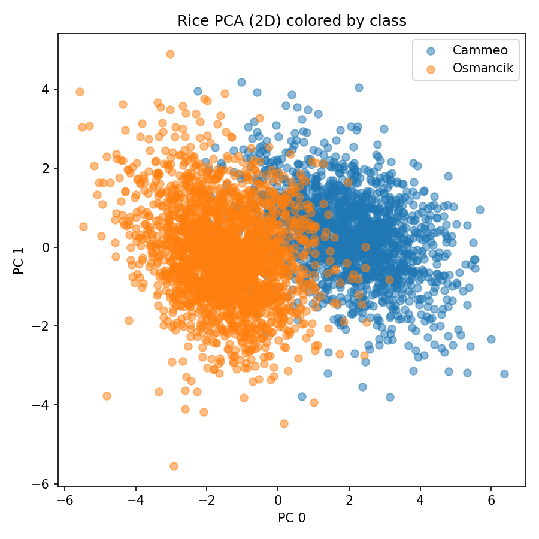
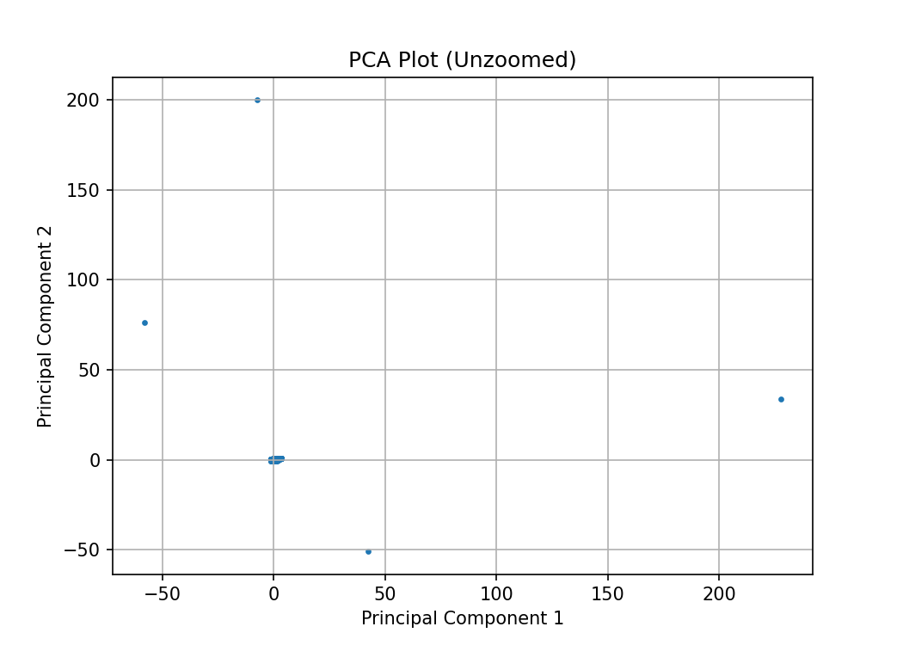
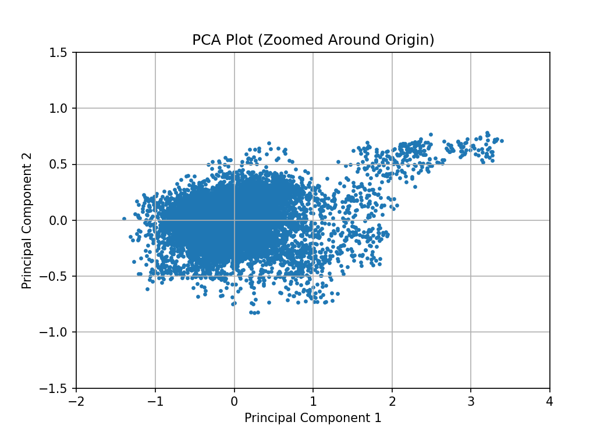
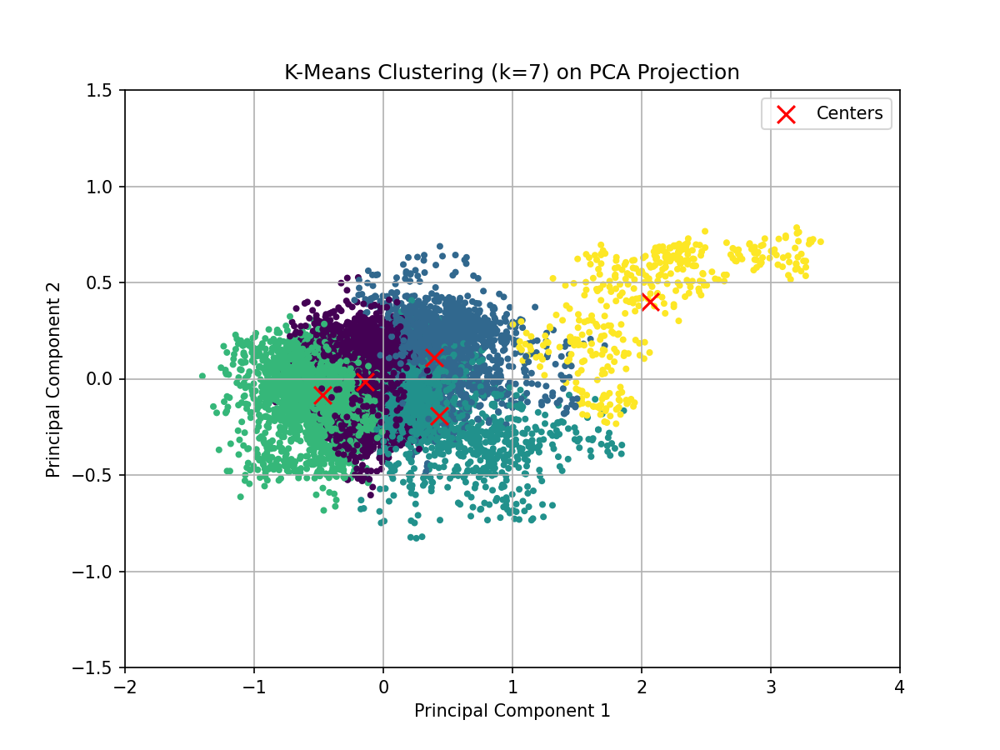
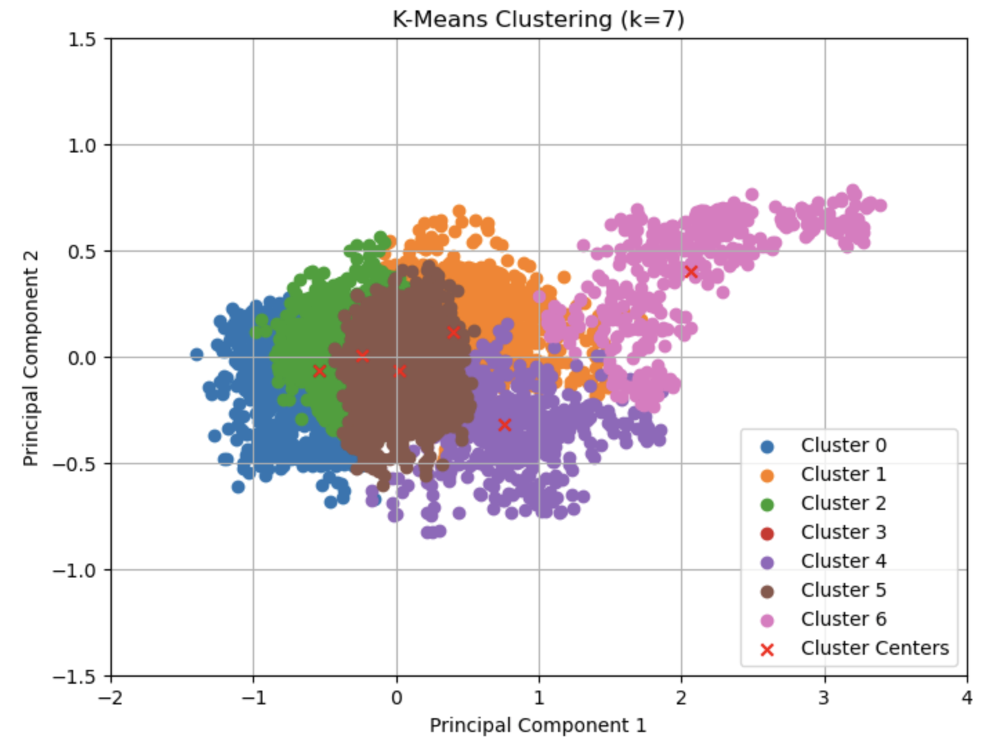
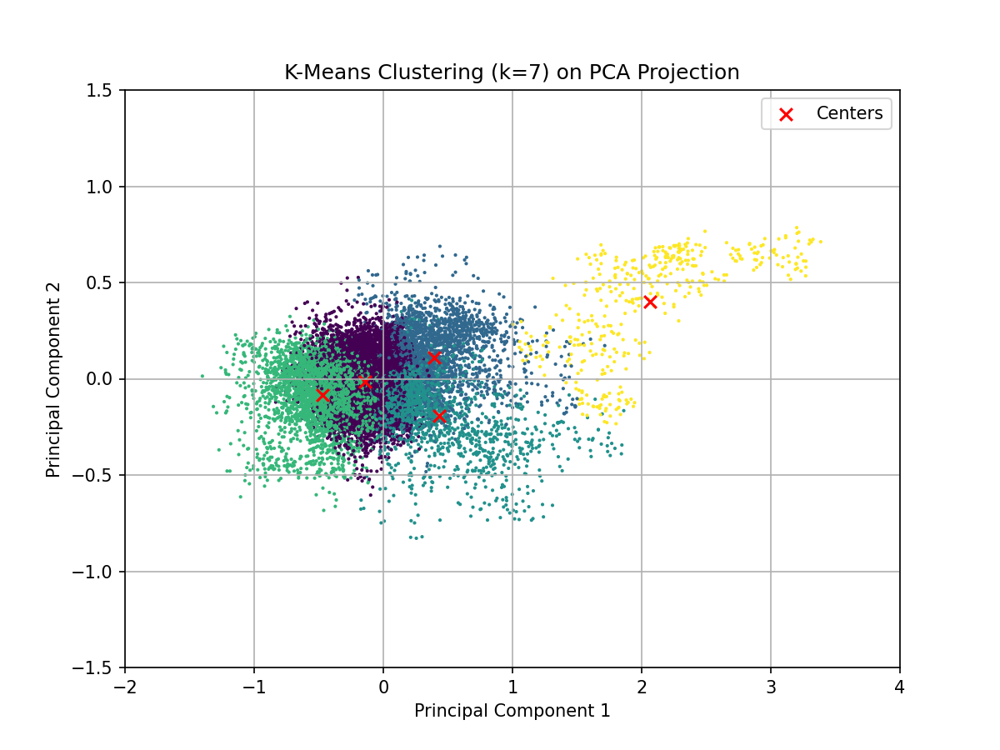
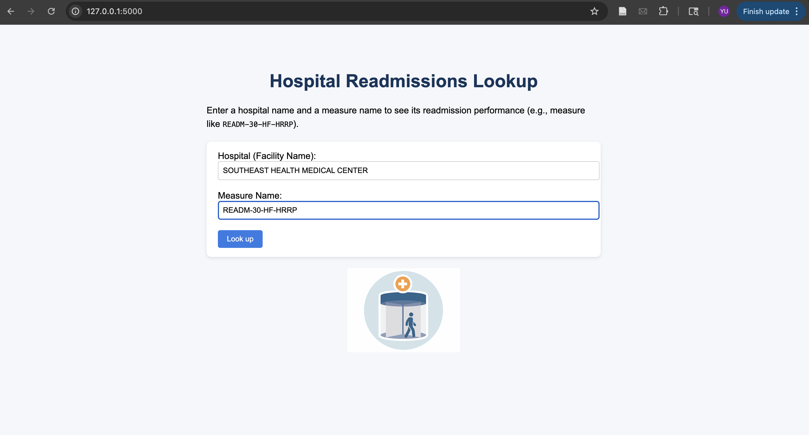
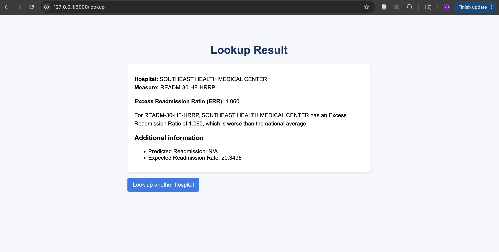
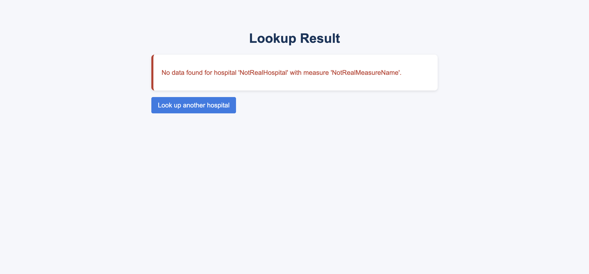
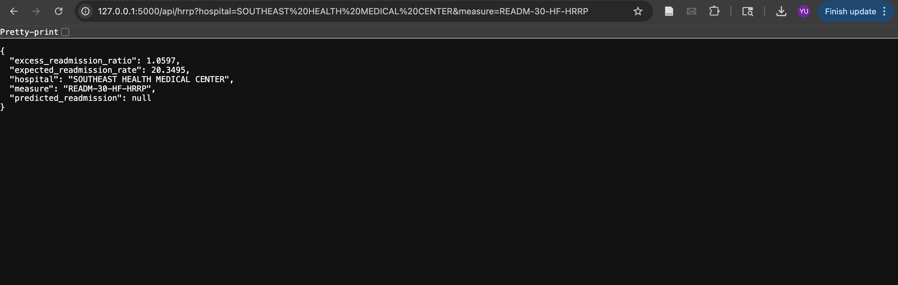

# Problem Set 4
**Name:** Yu (Irene) Wang<br>
**NetID:** yw2247        <br>
## Instructions to Run Code
- Python 3.x required  
- Install dependencies:  
  ```bash 
  pip install requests numpy pandas matplotlib scikit-learn flask openpyxl

### Exercise 1: Gradient Descent for Neural Network Parameter Optimization

1. Is http://ramcdougal.com/cgi-bin/error_function.py?a=0.4&b=0.2 a clean URL? <br>
No. A clean URL is human-readable and hides implementation details. The URL above exposes both the script path (/cgi-bin/error_function.py) and query parameters. A cleaner version would look like (e.g., /error/a/0.4/b/0.2). 

2. Gradient Descent Implementation (2D)
## How I estimated the gradient

Since the API only returns error values and does not provide derivatives, I used finite differences to approximate the gradient. For a point (a, b), I estimated the partial derivatives as: 

dE/da ≈ ( E(a+h, b) - E(a-h, b) ) / (2h)

dE/db ≈ ( E(a, b+h) - E(a, b-h) ) / (2h)

When a - h < 0, a + h > 1, or similarly for b, I used a one-sided difference so that the evaluation always stayed inside the domain [0,1] × [0,1]. 
The lecture slide uses a one-sided difference because it is easier to demonstrate. In my implementation, I used central differences whenever possible because they are more accurate, and I only used one-sided differences near the boundaries where central differences cannot be used.

## Numerical choices I made
I made the following numerical design choices:

Finite-difference step size:      h = 1e-3 <br>
Learning rate:                    alpha = 0.1 <br>
Stopping rule (gradient):         ||gradient|| < 1e-4 <br>
Stopping rule (parameter change): sqrt((delta(a))^2 + (delta(b))^2) < 1e-5 <br>
Maximum iterations:               200 <br>

## Why these choices are reasonable
h = 1e-3: <br>
I chose a small step size so the slope estimate would be reasonably accurate, but not so small that the calculation becomes unstable.

alpha = 0.1: <br>
This learning rate lets the algorithm move steadily toward the minimum without taking steps that are too large and cause it to jump around.

Stopping criteria: <br>
I stop the algorithm when the gradient is very small or when the updates to a and b become tiny. This means the algorithm is no longer making meaningful progress.

Maximum iterations: <br>
I include a limit on the number of steps so the code does not call the API too many times. This keeps the program efficient and prevents unnecessary server load. <br>

3. Finding the Local and Global Minima
## Local and Global Minima

I ran the algorithm from several different starting points:

Start=(0.100,0.100) -> a=0.215992, b=0.688960, err=1.100000<br>
Start=(0.900,0.900) -> a=0.216047, b=0.689014, err=1.100000<br>
Start=(0.100,0.900) -> a=0.215981, b=0.689035, err=1.100000<br>
Start=(0.900,0.100) -> a=0.712008, b=0.168997, err=1.000000<br>
Start=(0.500,0.500) -> a=0.216038, b=0.688975, err=1.100000<br>
Start=(0.536,0.332) -> a=0.711993, b=0.169007, err=1.000000<br>

These results show two clear convergence points:

A minimum near<br>
(a ≈ 0.216, b ≈ 0.689) with error ≈ 1.10

A minimum near<br>
(a ≈ 0.712, b ≈ 0.169) with error ≈ 1.00

Because the second point has the smaller error value, it is the global minimum, and the first point is the local minimum. 

## How I would determine local vs global minima if I did not know the answer

If I did not already know how many minima existed, I would use the same approach described above:

- Run gradient descent from many random starting points.
- Record the final values of a, b, and the error.
- Group the final points into distinct clusters (each cluster represents a minimum).
- Compare the error values of the clusters.
- The point with the smallest error would be considered the global minimum.


### Exercise 2: Sequence Alignment
## Testing <br>
I tested the align function with several examples to check both correctness and the effect of the scoring parameters (match, gap_penalty, and mismatch_penalty).

1. Reproducing the examples from the problem
```python
align('tgcatcgagaccctacgtgac', 'actagacctagcatcgac')
align('tgcatcgagaccctacgtgac', 'actagacctagcatcgac', gap_penalty=2)
```
With the default parameters, the function returns an alignment with score 8, matching the example alignment given in the problem.<br>
With gap_penalty=2, the function returns gcatcga aligned to gcatcga with score 7, which is the unique alignment given in the problem.<br>
This shows that the core Smith–Waterman implementation and scoring are consistent with the requirement.

2. Identical strings, default parameters
```python
align("ACGT", "ACGT")  # match=1, gap_penalty=1, mismatch_penalty=1
# Result: ("ACGT", "ACGT", 4)
``` 
Two identical strings should align completely with no gaps.<br>
The result is an exact match and the score is 4, which equals the length of the string (4 matches * 1 point each).<br>
This confirms that matches are scored correctly and that the diagonal path is preferred when sequences are the same.<br>

3. Completely different strings with high mismatch and gap penalties
```python
align("AAAA", "TTTT", match=2, mismatch_penalty=3, gap_penalty=2)
# Result: ("", "", 0)
``` 
Here every position is a mismatch, and both mismatches and gaps are heavily penalized.<br>
Any non-empty alignment would have negative score, so the correct Smith–Waterman behavior is to return an empty local alignment with score 0.<br>
The function does exactly that, showing that it correctly resets negative values to 0 and supports local (not global) alignment.<br>

4. Symmetry of the score
```python
sc_ab = align("GATTACA", "GCATGCU")[2]
sc_ba = align("GCATGCU", "GATTACA")[2]
# Result: sc_ab == sc_ba
``` 
Aligning sequence A against B and B against A gives the same score. This indicates that the scoring rules are applied consistently to both sequences.

5. Effect of changing the gap penalty
```python
low_gap  = align("ACGTACGT", "ACGACGT", gap_penalty=1)
high_gap = align("ACGTACGT", "ACGACGT", gap_penalty=4)

# low_gap  -> ("ACGTACGT", "ACG-ACGT", 6)
# high_gap -> ("ACGT", "ACGT", 4)
``` 
With a low gap penalty (gap_penalty=1), the alignment includes a single gap and keeps most of the sequence aligned.<br>
With a high gap penalty (gap_penalty=4), the function avoids introducing a gap and instead returns a shorter alignment without gaps.<br>
This shows that the gap_penalty parameter is being used correctly: increasing it makes gaps less attractive.<br>

Therefore, these tests show that the function correctly implements Smith–Waterman and responds to changes in match, mismatch, and gap penalties exactly as expected.

## Extra Credit <br>

### Exercise 3: Sequence Alignment
## Setup
This problem builds a 2D k-NN classifier without using sklearn’s k-NN. Instead of checking every point by brute force, the classifier uses a quad-tree to store the training data and quickly find nearby neighbors. The rice dataset includes seven numerical features for two rice types, Cammeo and Osmancik. 

## Data Normalization and PCA
These seven numerical features were standardized to have mean = 0 and standard deviation = 1, using only the training set mean and standard deviation. After normalization, I applied PCA with 2 components (fitting on the training set and transforming both training and test sets). These two components are the x- and y-coordinates for each rice grain in the 2D space used by the quad-tree.

## Scatterplot of PCA-Reduced Data
Below is the scatterplot of all grains in the 2D PCA space, color-coded by type of rice:



*Comment on what the graph suggests about the effeciveness of using k-nearest neighbors on this 2-dimensional reduction of the data to predict the type of rice.* <br>
The plot shows that Cammeo and Osmancik mostly form two separate groups, with some mixing in the middle. Because the two types are still somewhat apart, k-nearest neighbors should work fairly well on the 2D PCA data, though a few mistakes will happen where the groups overlap.

## Quad-Tree Implementation
A custom quad-tree was implemented to recursively partition the 2D PCA space:

Each node stores a bounding box and either:
- A list of points (if it is a leaf)
- Four children (if it is an internal node)

Nodes split when they contain more than a threshold number of points.

Helper methods implement:
- contains(x, y): whether a point lies in a node’s region
- _within_distance(x, y, d): whether a node may contain points within distance d
- leaves_within_distance: collect nearby leaf nodes

k-NN search expands a radius until at least k candidate points are found.

## k-NN Results and Confusion Matrices
A 70/30 train-test split with stratification was used.
k = 1 Confusion Matrix:

| True / Predicted | Cammeo | Osmancik |
|----------------------|------------|--------------|
| Cammeo          | 412        | 77           |
| Osmancik         | 58         | 596          |

Quad-Tree vs. brute-force agreement: 99.91%

k = 5 Confusion Matrix:

| True / Predicted | Cammeo | Osmancik |
|----------------------|------------|--------------|
| Cammeo          | 426        | 63           |
| Osmancik         | 41         | 613          |

Quad-Tree vs. brute-force agreement: 100%

With k = 1, the classifier already does very well, but it can make more mistakes because the prediction depends on only one nearby point. This makes it more sensitive to noise and to points that lie in the overlapping area of the two classes.

With k = 5, the number of errors goes down. Looking at five neighbors gives a more stable decision, since the majority vote reduces the effect of noisy or borderline points.

Additionally, to ensure correctness: A brute-force k-NN (distance to every training point) was used as a baseline. The quad-tree classifier’s predictions matched the brute-force predictions with:<br>
99.91% agreement for k = 1<br>
100% agreement for k = 5<br>
This confirms that the quad-tree querying logic was implemented correctly.<br>

### Exercise 4: EEG Clustering

PCA Plot of Standardized Data (Unzoomed):



PCA Plot of Standardized Data (Zoomed Near Origin):


K-Means Clustering (k = 7) Projected onto First Two Principal Components: 



1. Why do we see only 6 clusters when k = 7 in the image below?<br>

Even though k-means creates 7 clusters in the full 14-dimensional space, the plot only shows the first two PCA components. Two of the clusters are mainly separated in the other dimensions, so when everything is projected into 2D, those two clusters land almost on top of each other. As a result, the figure shows only about 6 visible clusters even though all 7 exist.

2. Why do clusters look overlapping/non-convex, with three centers in the brown region and none in the blue?<br>
K-means still makes convex and non-overlapping clusters in the original 14D space. The strange shapes come from projecting the data into only two PCA directions. When high-dimensional clusters are flattened into 2D, their regions can overlap, and different cluster centers can project to nearly the same place. That’s why several centers appear inside the brown region and the blue center doesn’t appear in the middle of the blue points.

3. Is this a representative view of the clusters? Does plotting smaller points change your understanding?<br>
No, this plot is not fully representative because it only uses PC1 and PC2. The clusters may be separated in higher dimensions even if they overlap here. When the points are plotted smaller, it becomes easier to see that many colors are mixed together in the center, which shows even more clearly that the 2D view hides much of the real separation that exists in 14-D.



4. What happens when you repeat k-means several times?<br>
When I repeated k-means with different random seeds, some cluster centers stayed almost the same across runs, while others changed a lot. For example, one center appeared in Run 1, Run 3, and Run 5 with almost identical values:

[2.06, 0.40, 1.68, 3.23, 2.13, 1.07, 0.44, 0.12, ...]

This shows that this cluster is stable and k-means finds it consistently.

In contrast, another center changed dramatically across runs. For example:

Run 1: 135.12, -8.77, 7.72, ...

Run 2: -7.49, 200.06, 83.47, ...

Run 4: -57.95, 76.28, -142.48, ...

Because these centers are completely different, this cluster is unstable and depends heavily on the initialization. Overall, some clusters are found consistently, but others vary because k-means can converge to different local optima.

### Exercise 5. Python and the Web

I've watched the whole video on Python and the Web and asked the TFs or Professor any questions I might have on this material.

1. Who presented the lecture? <br>
Prof. Robert McDougal. 

2. What framework was demonstrated for building web servers?<br>
The framework demonstrated was Flask, which is a lightweight Python web framework.

3. How does the approach of the framework differ from "classical" servers that simply provide static web content? <br>
A static server can only send fixed files like HTML or images, but Flask can run Python code to create content dynamically. It can take user input from the URL or from GET/POST requests, fill in HTML templates with values, and use @app.route to connect different URLs to different functions. Because the Flask app keeps running, it can also hold data in memory. These features allow Flask to create interactive, data-driven pages that static servers cannot produce.

4. Briefly explain how you might use the "Developer tools" to debug JavaScript issues in your web pages.<br>
I would use the Developer Tools to inspect the page using the Elements panel, which shows the HTML structure and how the browser is rendering each part of the page. I can check the styles being applied and edit them live to see how the page changes. This helps me notice when something is not showing up correctly, especially when JavaScript is supposed to change the page. I can also use the Console to see errors, the Sources tab to step through the code, and the Network tab to check whether JavaScript requests are working.

5. Explain briefly how the app.route decorator is used to implement a RESTful API.<br>
@app.route tells Flask which URL should run a given function and what values to take from the URL. Each route becomes an endpoint. For example (in the lecture):
```python
@app.route("/add/<int:a>/<int:b>")
def add(a, b):
    return {"result": a + b}
```
Visiting /add/5/3 will call add(5, 3) and return the result. Routes can also specify which HTTP methods they accept, but this example uses the default GET method.

### Exercise 6: Interactive web exploration of data set
*Start by examining each file in flask-example and running the server.py script. What does each file do? How are they interconnected? Are there any key parts of the files for making the server do something?*

In the flask-example folder there are three main files that work together:<br>

server.py<br>
This is the main Python program that creates the Flask app and starts the web server (app = Flask(__name__), app.run()).<br>
It defines two routes with @app.route:

"/" calls the index() function, which returns render_template("index.html") and shows the input page.

"/analyze" with methods=["POST"] calls the analyze() function, which reads the user’s text from request.form["usertext"], analyzes it with Counter, and then returns render_template("analyze.html", analysis=result, usertext=usertext).

templates/index.html<br>
This is the first page the user sees. It displays a message and a form with a <textarea name="usertext"> and a submit button.<br>
The form sends the text to the /analyze route using method="POST", so that server.py can process it.

templates/analyze.html<br>
This is the results page. It uses template placeholders {{ usertext }} and {{ analysis }} to show the original text and the analysis string passed from server.py.

These files are interconnected through Flask’s routing and templating: server.py controls the logic and calls render_template to load the HTML files from the templates folder, while the HTML files define the user interface and display the data coming from Python. The key parts that make the server do something are app = Flask(__name__), the @app.route decorators, the use of request.form to read input, render_template to return pages, and app.run() to start the server.

## Question on HRRP dataset<br>
*Question:*<br>
For a given hospital and readmission measure, what is its Excess Readmission Ratio (ERR), and is this better than, about the same as, or worse than the national average?

*Input text:*<br>
- Hospital name (from the Facility Name column)<br>
- Measure name (from the Measure Name column, e.g., READM-30-HF-HRRP for heart failure)<br>

*Output text:*<br>
A short text summary that includes:<br>
- The hospital name and measure name<br>
- The hospital’s Excess Readmission Ratio (ERR)<br>
- A simple interpretation:<br>
    - ERR < 0.98 -> “better than national average”<br>
    - 0.98 ≤ ERR ≤ 1.02 -> “about the same as national average”<br>
    - ERR > 1.02 -> “worse than national average”<br>

*Example output:*<br>
For READM-30-HF-HRRP, SOUTHEAST HEALTH MEDICAL CENTER has an Excess Readmission Ratio of 0.95, which is better than the national average.

*How the response is determined from the data:*<br>
1. After the user submits the form, the Flask server uses Facility Name and Measure Name to filter the dataset to the matching row.<br>
2. It reads the value in the “Excess Readmission Ratio” column for that row.<br>
3. It compares the ERR to 1.0 using the thresholds above to decide whether the performance is better than, similar to, or worse than the national average.<br>
4. It constructs a short English sentence with the hospital name, measure name, ERR, and interpretation, and displays this on a new results page.<br>

## Using Flask to create an interactive website
Please see the code in the folder hrrp-flask. 

## Screenshots 

Input:



Result of the data lookup (& Multiple Analyses):



Error Handling (no matching hospital + measure):




Error Handling (missing fields):


API Endpoint:



## Extra Credits:

1. Error handling:<br>
If the user leaves fields blank or if no matching hospital + measure is found, the result page shows a clear error message.

2. Styling with CSS:<br>
The style.css file adds basic layout, card styling, colors, and button styling.

3. Relevant static image:<br>
index.html includes a hospital readmission related image (hospital.png) in the static/ folder.

4. API endpoint: <br>
The /api/hrrp?hospital=...&measure=... route returns ERR, predicted readmission, and expected readmission rate as JSON.

5. Multiple analyses: <br>
The result page shows not only the Excess Readmission Ratio, but also the predicted readmission and expected readmission rate. It also shows a short text interpretation of whether the hospital is better/worse/about the same as the national average.

## Appendix: Full Code
```python
# -----------------------
# Exercise 1
# -----------------------
import requests
a = 0.4
b = 0.2
float(requests.get(f"http://ramcdougal.com/cgi-bin/error_function.py?a={a}&b={b}", headers={"User-Agent": "MyScript"}).text)

import random
import math

BASE_URL = "http://ramcdougal.com/cgi-bin/error_function.py"
HEADERS = {"User-Agent": "MyScript"}  

def get_error(a, b):
    resp = requests.get(
        BASE_URL,
        params={"a": a, "b": b},
        headers=HEADERS
    )
    resp.raise_for_status()
    return float(resp.text.strip())

def estimate_gradient(a, b, h=1e-3):
    # partial wrt a
    if a - h >= 0 and a + h <= 1:
        Ea_plus  = get_error(a + h, b)
        Ea_minus = get_error(a - h, b)
        dEa = (Ea_plus - Ea_minus) / (2 * h)
    elif a - h < 0:  # near lower bound
        Ea_plus  = get_error(a + h, b)
        Ea       = get_error(a, b)
        dEa = (Ea_plus - Ea) / h
    else:            # near upper bound
        Ea       = get_error(a, b)
        Ea_minus = get_error(a - h, b)
        dEa = (Ea - Ea_minus) / h

    # partial wrt b
    if b - h >= 0 and b + h <= 1:
        Eb_plus  = get_error(a, b + h)
        Eb_minus = get_error(a, b - h)
        dEb = (Eb_plus - Eb_minus) / (2 * h)
    elif b - h < 0:
        Eb_plus = get_error(a, b + h)
        Eb      = get_error(a, b)
        dEb = (Eb_plus - Eb) / h
    else:
        Eb      = get_error(a, b)
        Eb_minus = get_error(a, b - h)
        dEb = (Eb - Eb_minus) / h

    return dEa, dEb

def gradient_descent_2d(
    a0,
    b0,
    alpha=0.1,
    h=1e-3,
    tol_grad=1e-4,
    tol_param=1e-5,
    max_iters=200
):
    a, b = a0, b0
    E = get_error(a, b)

    for it in range(max_iters):
        dEa, dEb = estimate_gradient(a, b, h=h)

        # gradient norm as a stopping measure
        grad_norm = math.sqrt(dEa**2 + dEb**2)
        if grad_norm < tol_grad:
            break

        # gradient descent step
        new_a = a - alpha * dEa
        new_b = b - alpha * dEb

        # project back into [0, 1]
        new_a = min(1.0, max(0.0, new_a))
        new_b = min(1.0, max(0.0, new_b))

        # check parameter change
        delta = math.sqrt((new_a - a)**2 + (new_b - b)**2)
        a, b = new_a, new_b
        new_E = get_error(a, b)

        if delta < tol_param:
            E = new_E
            break

        E = new_E

    return a, b, E, it + 1

a_opt, b_opt, err_opt, n = gradient_descent_2d(0.7, 0.3)
print(a_opt, b_opt, err_opt, n)

starts = [
    (0.1, 0.1),
    (0.9, 0.9),
    (0.1, 0.9),
    (0.9, 0.1),
    (0.5, 0.5),
    (random.random(), random.random())
]

results = []

for (a0, b0) in starts:
    a_opt, b_opt, err_opt, n = gradient_descent_2d(a0, b0)
    results.append((a0, b0, a_opt, b_opt, err_opt, n))

for r in results:
    print(f"Start=({r[0]:.3f},{r[1]:.3f}) -> "
          f"a={r[2]:.6f}, b={r[3]:.6f}, err={r[4]:.6f}, iters={r[5]}")

# -----------------------
# Exercise 2
# -----------------------

import numpy as np

def align(seq1, seq2, match=1, gap_penalty=1, mismatch_penalty=1):
    m = len(seq1)
    n = len(seq2)
    
    # Score matrix H, initialized to 0
    H = np.zeros((m + 1, n + 1), dtype=int)
    
    best_score = 0
    best_pos = (0, 0)  # (i, j) where best_score occurs
    
    for i in range(1, m + 1):
        for j in range(1, n + 1):
            # score from diagonal (match/mismatch)
            if seq1[i - 1] == seq2[j - 1]:
                score_diag = H[i - 1, j - 1] + match
            else:
                score_diag = H[i - 1, j - 1] - mismatch_penalty
            
            # score from up (gap in seq2)
            score_up   = H[i - 1, j] - gap_penalty
            # score from left (gap in seq1)
            score_left = H[i, j - 1] - gap_penalty
            
            # Smith–Waterman: local alignment -> no negative scores
            H[i, j] = max(0, score_diag, score_up, score_left)
            
            # track global maximum
            if H[i, j] > best_score:
                best_score = H[i, j]
                best_pos = (i, j)
    
    aligned1 = []
    aligned2 = []
    i, j = best_pos
    
    # Do not store parent pointers
    # Recompute which predecessor could have produced H[i, j]
    while i > 0 and j > 0 and H[i, j] > 0:
        score_current = H[i, j]
        
        # recompute predecessors
        if seq1[i - 1] == seq2[j - 1]:
            score_diag = H[i - 1, j - 1] + match
        else:
            score_diag = H[i - 1, j - 1] - mismatch_penalty
        
        score_up   = H[i - 1, j] - gap_penalty
        score_left = H[i, j - 1] - gap_penalty
        
        # prefer diagonal when possible, then up, then left 
        if score_current == score_diag:
            aligned1.append(seq1[i - 1])
            aligned2.append(seq2[j - 1])
            i -= 1
            j -= 1
        elif score_current == score_up:
            aligned1.append(seq1[i - 1])
            aligned2.append('-')
            i -= 1
        elif score_current == score_left:
            aligned1.append('-')
            aligned2.append(seq2[j - 1])
            j -= 1
        else:
            # if no predecessor matches, stop
            break
    
    aligned1 = ''.join(reversed(aligned1))
    aligned2 = ''.join(reversed(aligned2))
    
    return aligned1, aligned2, int(best_score)

# given tests
seq1, seq2, score = align('tgcatcgagaccctacgtgac', 'actagacctagcatcgac', gap_penalty=2)
print(seq1)
print(seq2)
print(score)

seq3, seq4, score2 = align('tgcatcgagaccctacgtgac', 'actagacctagcatcgac')
print(seq3)
print(seq4)
print(score2)

# additional tests 
# test 1: identical strings with default parameters
align("ACGT", "ACGT")  # default match=1, gap_penalty=1, mismatch_penalty=1
# expected output: ("ACGT", "ACGT", 4)

# test 2: completely different strings with high mismatch penalty
align("AAAA", "TTTT", match=2, mismatch_penalty=3, gap_penalty=2)
# expected output: ("", "", 0)

# test 3: symmetry score test
sc_ab = align("GATTACA", "GCATGCU")[2]
sc_ba = align("GCATGCU", "GATTACA")[2]
assert sc_ab == sc_ba, "Alignment scores should be symmetric"

# test 4: gap penalty effect test
low_gap = align("ACGTACGT", "ACGACGT", gap_penalty=1)
high_gap = align("ACGTACGT", "ACGACGT", gap_penalty=4)

low_gap, high_gap

# -----------------------
# Exercise 3
# -----------------------

import numpy as np
import pandas as pd
import matplotlib.pyplot as plt
from sklearn import decomposition
from collections import Counter
from sklearn.model_selection import train_test_split

# QuadTree implementation
class QuadTree:
    def __init__(self, x_lo, y_lo, x_hi, y_hi, points, max_points=20, depth=0, max_depth=20, parent=None):
        self.x_lo = x_lo
        self.y_lo = y_lo
        self.x_hi = x_hi
        self.y_hi = y_hi
        self.parent = parent
        self.children = []   
        self.points = points
        self.max_points = max_points
        self.depth = depth
        self.max_depth = max_depth

        # Decide whether to split
        if len(self.points) > self.max_points and self.depth < self.max_depth:
            self._split()

    def _split(self):
        # Compute midpoints
        x_mid = 0.5 * (self.x_lo + self.x_hi)
        y_mid = 0.5 * (self.y_lo + self.y_hi)

        # Initialize children with empty point lists
        nw_points = []
        ne_points = []
        sw_points = []
        se_points = []

        # Assign points to quadrants
        for (x, y, label, idx) in self.points:
            if x <= x_mid and y >= y_mid:
                nw_points.append((x, y, label, idx))
            elif x > x_mid and y >= y_mid:
                ne_points.append((x, y, label, idx))
            elif x <= x_mid and y < y_mid:
                sw_points.append((x, y, label, idx))
            else:
                se_points.append((x, y, label, idx))

        # Create child nodes
        self.children = [
            QuadTree(self.x_lo, y_mid,   x_mid,   self.y_hi, nw_points, self.max_points, self.depth+1, self.max_depth, parent=self),
            QuadTree(x_mid,   y_mid,   self.x_hi, self.y_hi, ne_points, self.max_points, self.depth+1, self.max_depth, parent=self),
            QuadTree(self.x_lo, self.y_lo, x_mid, y_mid,     sw_points, self.max_points, self.depth+1, self.max_depth, parent=self),
            QuadTree(x_mid,   self.y_lo, self.x_hi, y_mid,   se_points, self.max_points, self.depth+1, self.max_depth, parent=self),
        ]

        self.points = []

    # Helper methods
    def is_leaf(self):
        return len(self.children) == 0

    def contains(self, x, y):
        """Check if this bounding box contains point (x, y)."""
        return (self.x_lo <= x <= self.x_hi) and (self.y_lo <= y <= self.y_hi)

    def small_containing_quadtree(self, x, y):
        """
        Return the smallest subtree (leaf) whose box contains (x, y).
        """
        if not self.contains(x, y):
            return None
        if self.is_leaf():
            return self
        for child in self.children:
            if child.contains(x, y):
                return child.small_containing_quadtree(x, y)
        return self  

    def _within_distance(self, x, y, d):
        """
        Return True if the rectangle of this node is within distance d of point (x, y),
        meaning the circle of radius d around (x, y) intersects the rectangle.
        """
        # Find closest point in rectangle to (x, y)
        closest_x = min(max(x, self.x_lo), self.x_hi)
        closest_y = min(max(y, self.y_lo), self.y_hi)
        dx = closest_x - x
        dy = closest_y - y
        return (dx*dx + dy*dy) <= d*d

    def leaves_within_distance(self, x, y, d, result=None):
        """
        Collect all leaf nodes whose bounding box is within distance d of (x, y).
        """
        if result is None:
            result = []

        if not self._within_distance(x, y, d):
            return result

        if self.is_leaf():
            result.append(self)
        else:
            for child in self.children:
                child.leaves_within_distance(x, y, d, result)

        return result

    def all_points(self):
        """
        Return all points in this subtree as a list.
        """
        if self.is_leaf():
            return list(self.points)
        else:
            pts = []
            for child in self.children:
                pts.extend(child.all_points())
            return pts


# k-NN using QuadTree for neighbor search
class KNNQuadTreeClassifier:
    def __init__(self, k):
        self.k = k
        self.quadtree = None
        self.labels_array = None
        self.X_train = None

    def fit(self, X, y):
        """
        X: array of shape (n_samples, 2)  (pc0, pc1)
        y: array of shape (n_samples,)    (labels)
        """
        self.X_train = X
        self.labels_array = np.array(y)

        x_coords = X[:, 0]
        y_coords = X[:, 1]

        # Root bounding box with small margins
        margin = 1e-6
        x_lo, x_hi = x_coords.min() - margin, x_coords.max() + margin
        y_lo, y_hi = y_coords.min() - margin, y_coords.max() + margin

        # points: (x, y, label, index)
        points = [(x_coords[i], y_coords[i], self.labels_array[i], i) for i in range(len(self.labels_array))]

        self.quadtree = QuadTree(x_lo, y_lo, x_hi, y_hi, points, max_points=20, max_depth=20)

    def _find_k_nearest_indices(self, x, y):
        """
        Use expanding-radius search over the quadtree to collect at least k candidate points,
        then pick the k closest among them.
        """
        # Start with a small radius based on data spread
        if self.X_train is None:
            raise ValueError("Model not fitted yet.")

        # Rough scale for initial radius
        spread = np.std(self.X_train, axis=0).mean()
        if spread == 0:
            spread = 1.0
        radius = spread * 0.5

        candidates = []
        max_iterations = 20
        factor = 2.0

        for _ in range(max_iterations):
            leaves = self.quadtree.leaves_within_distance(x, y, radius, result=[])
            candidates = []
            for leaf in leaves:
                candidates.extend(leaf.points)
            if len(candidates) >= self.k:
                break
            radius *= factor

        if len(candidates) == 0:
            # fallback: use all training points
            candidates = [(self.X_train[i, 0], self.X_train[i, 1], self.labels_array[i], i)
                          for i in range(len(self.labels_array))]

        # Compute distances to all candidates
        cand_coords = np.array([[px, py] for (px, py, lab, idx) in candidates])
        cand_indices = np.array([idx for (px, py, lab, idx) in candidates])
        diffs = cand_coords - np.array([x, y])
        dists = np.sum(diffs**2, axis=1)

        if len(dists) <= self.k:
            # fewer than or equal to k candidates; just return all
            return cand_indices

        # find indices of the smallest k distances
        min_i = np.argpartition(dists, self.k)[:self.k]
        return cand_indices[min_i]

    def predict_one(self, x, y):
        knn_indices = self._find_k_nearest_indices(x, y)
        knn_labels = self.labels_array[knn_indices]
        most_common = Counter(knn_labels).most_common(1)[0][0]
        return most_common

    def predict(self, X):
        preds = []
        for i in range(X.shape[0]):
            preds.append(self.predict_one(X[i, 0], X[i, 1]))
        return np.array(preds)


# simple k-NN for testing 
def knn_predict(X_train, y_train, X_test, k):
    predictions = []
    for i in range(X_test.shape[0]):
        diff = X_train - X_test[i]
        dists = np.sum(diff**2, axis=1)
        if len(dists) <= k:
            k_idx = np.arange(len(dists))
        else:
            k_idx = np.argpartition(dists, k)[:k]
        k_labels = y_train[k_idx]
        most_common = Counter(k_labels).most_common(1)[0][0]
        predictions.append(most_common)
    return np.array(predictions)


# Main analysis pipeline
def main():
    # 1. Load data
    data = pd.read_excel('Rice_Cammeo_Osmancik.xlsx')
    feature_cols = [col for col in data.columns if col != "Class"]
    class_col = "Class"

    X = data[feature_cols].values
    y = data[class_col].values

    # 2. Train-test split
    X_train_raw, X_test_raw, y_train, y_test = train_test_split(
        X, y, test_size=0.3, random_state=42, stratify=y
    )

    # 3. Normalize based on training set mean and std
    mean = X_train_raw.mean(axis=0)
    std = X_train_raw.std(axis=0, ddof=0)
    std[std == 0] = 1.0  # avoid division by zero

    X_train_norm = (X_train_raw - mean) / std
    X_test_norm = (X_test_raw - mean) / std

    # 4. PCA to 2D
    pca = decomposition.PCA(n_components=2)
    X_train_reduced = pca.fit_transform(X_train_norm)
    X_test_reduced = pca.transform(X_test_norm)

    # Also reduce full dataset for plotting
    X_all_norm = (X - mean) / std
    X_all_reduced = pca.transform(X_all_norm)

    # 5. Scatterplot
    pc0 = X_all_reduced[:, 0]
    pc1 = X_all_reduced[:, 1]

    plt.figure(figsize=(6, 6))
    classes = np.unique(y)
    for c in classes:
        mask = (y == c)
        plt.scatter(pc0[mask], pc1[mask], alpha=0.5, label=str(c))
    plt.xlabel('PC 0')
    plt.ylabel('PC 1')
    plt.title('Rice PCA (2D) colored by class')
    plt.legend()
    plt.tight_layout()
    plt.savefig('rice_pca_scatter.png', dpi=150)
    plt.close()

    # 6. Fit k-NN with QuadTree (k=1 and k=5)
    for k_val in [1, 5]:
        print(f"QuadTree k-NN with k={k_val}")
        knn_qt = KNNQuadTreeClassifier(k=k_val)
        knn_qt.fit(X_train_reduced, y_train)
        y_pred_qt = knn_qt.predict(X_test_reduced)

        # Confusion matrix
        cm = pd.crosstab(pd.Series(y_test, name='True'),
                         pd.Series(y_pred_qt, name='Predicted'))

        print("Confusion matrix:")
        print(cm)
    
        # compare with simple k-NN
        y_pred_brute = knn_predict(X_train_reduced, y_train, X_test_reduced, k_val)
        agreement = np.mean(y_pred_brute == y_pred_qt)
        print(f"Agreement QuadTree vs Simple k-NN for k={k_val}: {agreement:.4f}")


if __name__ == "__main__":
    main()

# -----------------------
# Exercise 4
# -----------------------

import pandas as pd
import numpy as np
import matplotlib.pyplot as plt
from sklearn.preprocessing import StandardScaler
from sklearn.decomposition import PCA
from sklearn.cluster import KMeans

# 1. Load data
df = pd.read_csv("eeg-eye-state.csv")
df = df.drop(columns=["eyeDetection"])

# Standardize
scaler = StandardScaler()
X_std = scaler.fit_transform(df)

# 2. PCA (keep 14 comps)
pca = PCA(n_components=14)
X_pca = pca.fit_transform(X_std)

# 3. PCA Plot (default scale)
plt.figure(figsize=(7, 5))
plt.scatter(X_pca[:, 0], X_pca[:, 1], s=5)
plt.xlabel("Principal Component 1")
plt.ylabel("Principal Component 2")
plt.title("PCA Plot (Unzoomed)")
plt.grid(True)
plt.savefig('pca_plot_unzoomed.png', dpi=150)

# 4. PCA Plot (zoom near origin)
plt.figure(figsize=(7, 5))
plt.scatter(X_pca[:, 0], X_pca[:, 1], s=5)
plt.xlim(-2, 4)
plt.ylim(-1.5, 1.5)
plt.xlabel("Principal Component 1")
plt.ylabel("Principal Component 2")
plt.title("PCA Plot (Zoomed Around Origin)")
plt.grid(True)
plt.savefig('pca_plot_zoomed.png', dpi=150)

# 5. K-Means (k=7, random init)
k = 7
kmeans = KMeans(n_clusters=k, init="random", n_init=10, random_state=0)
clusters = kmeans.fit_predict(X_std)

# Project cluster centers into PCA space
centers_pca = pca.transform(kmeans.cluster_centers_)

# 6. Cluster Plot
plt.figure(figsize=(8, 6))
scatter = plt.scatter(X_pca[:, 0], X_pca[:, 1], c=clusters, s=8)

# plot centers
plt.scatter(centers_pca[:, 0], centers_pca[:, 1], c="red", marker="x", s=100, label="Centers")
# Zoom in
plt.xlim(-2, 4)
plt.ylim(-1.5, 1.5)

plt.xlabel("Principal Component 1")
plt.ylabel("Principal Component 2")
plt.title("K-Means Clustering (k=7) on PCA Projection")
plt.legend()
plt.grid(True)
plt.savefig('pca_cluster_plot.png', dpi=150)

# 6. Cluster Plot (smaller points)
plt.figure(figsize=(8, 6))
scatter = plt.scatter(X_pca[:, 0], X_pca[:, 1], c=clusters, s=1)

# plot centers
plt.scatter(centers_pca[:, 0], centers_pca[:, 1], c="red", marker="x", s=50, label="Centers")
# Zoom in
plt.xlim(-2, 4)
plt.ylim(-1.5, 1.5)

plt.xlabel("Principal Component 1")
plt.ylabel("Principal Component 2")
plt.title("K-Means Clustering (k=7) on PCA Projection")
plt.legend()
plt.grid(True)
plt.savefig('pca_cluster_plot2.png', dpi=150)


# 7. Repeat k-means several times
all_centers = []

for seed in [0, 10, 20, 50, 99]:
    km = KMeans(n_clusters=k, init="random", n_init=10, random_state=seed)
    km.fit(X_std)
    all_centers.append(km.cluster_centers_)

# Show how different the centers are
for i, c in enumerate(all_centers):
    print(f"\nRun {i+1} centers (seed = { [0,10,20,50,99][i] }):")
    print(pca.transform(c))  

# --------------------------------
# Exercise 6 (folder hrrp-flask)
# --------------------------------

# hrrp-flask/server.py
from flask import Flask, render_template, request, jsonify
import pandas as pd
import math

app = Flask(__name__)
hrrp = pd.read_csv("hrrp_data.csv")
hrrp.columns = [c.strip() for c in hrrp.columns]

@app.route("/")
def index():
    """Show the input form."""
    return render_template("index.html")


@app.route("/lookup", methods=["POST"])
def lookup():
    """Handle form submission, look up hospital + measure, and show result page."""
    hospital = request.form.get("hospital", "").strip()
    measure = request.form.get("measure", "").strip()

    # empty input
    if not hospital or not measure:
        error_message = "Please enter both a hospital name and a measure name."
        return render_template("result.html", error=error_message)

    # Case-insensitive matching on Facility Name and Measure Name
    df = hrrp.copy()
    df["Facility_lower"] = df["Facility Name"].str.strip().str.lower()
    df["Measure_lower"] = df["Measure Name"].str.strip().str.lower()

    mask = (
        (df["Facility_lower"] == hospital.lower())
        & (df["Measure_lower"] == measure.lower())
    )
    subset = df[mask]

    # Error handling: no matching rows
    if subset.empty:
        error_message = (
            f"No data found for hospital '{hospital}' "
            f"with measure '{measure}'."
        )
        return render_template("result.html", error=error_message)

    # If multiple rows match, just take the first one
    row = subset.iloc[0]

    # Pull out numeric fields (handle N/A)
    err = row.get("Excess Readmission Ratio", float("nan"))
    predicted = row.get("Predicted Readmission", float("nan"))
    expected = row.get("Expected Readmission Rate", float("nan"))

    # Interpretation of ERR
    interpretation = "No Excess Readmission Ratio available."
    err_display = "N/A"
    if not (isinstance(err, str)) and not math.isnan(err):
        err_display = f"{err:.3f}"
        if err < 0.98:
            interpretation = "better than the national average."
        elif err > 1.02:
            interpretation = "worse than the national average."
        else:
            interpretation = "about the same as the national average."

    summary_text = (
        f"For {measure}, {hospital} has an Excess Readmission Ratio of "
        f"{err_display}, which is {interpretation}"
    )

    # extra fields for multiple analyses
    predicted_display = (
        f"{predicted:.4f}" if isinstance(predicted, (int, float)) and not math.isnan(predicted)
        else "N/A"
    )
    expected_display = (
        f"{expected:.4f}" if isinstance(expected, (int, float)) and not math.isnan(expected)
        else "N/A"
    )

    return render_template(
        "result.html",
        error=None,
        hospital=hospital,
        measure=measure,
        err=err_display,
        summary=summary_text,
        predicted=predicted_display,
        expected=expected_display,
    )


# simple JSON API endpoint
@app.route("/api/hrrp")
def api_hrrp():
    """
    Simple API: /api/hrrp?hospital=...&measure=...
    Returns ERR, predicted, expected as JSON.
    """
    hospital = request.args.get("hospital", "").strip()
    measure = request.args.get("measure", "").strip()

    if not hospital or not measure:
        return jsonify(
            {"error": "Please provide both 'hospital' and 'measure' query parameters."}
        ), 400

    df = hrrp.copy()
    df["Facility_lower"] = df["Facility Name"].str.strip().str.lower()
    df["Measure_lower"] = df["Measure Name"].str.strip().str.lower()

    mask = (
        (df["Facility_lower"] == hospital.lower())
        & (df["Measure_lower"] == measure.lower())
    )
    subset = df[mask]

    if subset.empty:
        return jsonify(
            {"error": f"No data for hospital '{hospital}' and measure '{measure}'."}
        ), 404

    row = subset.iloc[0]
    err = row.get("Excess Readmission Ratio", None)
    predicted = row.get("Predicted Readmission", None)
    expected = row.get("Expected Readmission Rate", None)

    return jsonify(
        {
            "hospital": hospital,
            "measure": measure,
            "excess_readmission_ratio": None if pd.isna(err) else float(err),
            "predicted_readmission": None if pd.isna(predicted) else float(predicted),
            "expected_readmission_rate": None if pd.isna(expected) else float(expected),
        }
    )


if __name__ == "__main__":
    app.run(debug=True)

# hrrp-flask/templates/index.html
<!DOCTYPE html>
<html>
  <head>
    <meta charset="utf-8">
    <title>HRRP Lookup</title>
    <link rel="stylesheet" href="{{ url_for('static', filename='style.css') }}">
  </head>
  <body>
    <div class="container">
      <h1>Hospital Readmissions Lookup</h1>
      <p>
        Enter a hospital name and a measure name to see its readmission performance
        (e.g., measure like <code>READM-30-HF-HRRP</code>).
      </p>

      <form action="{{ url_for('lookup') }}" method="POST" class="card">
        <label for="hospital">Hospital (Facility Name):</label><br>
        <input type="text" id="hospital" name="hospital" required><br><br>

        <label for="measure">Measure Name:</label><br>
        <input type="text" id="measure" name="measure" required><br><br>

        <input type="submit" value="Look up" class="btn">
      </form>

      <div class="image-box">
        
      </div>
    </div>
  </body>
</html>

# hrrp-flask/templates/result.html

<!DOCTYPE html>
<html>
  <head>
    <meta charset="utf-8">
    <title>HRRP Result</title>
    <link rel="stylesheet" href="{{ url_for('static', filename='style.css') }}">
  </head>
  <body>
    <div class="container">
      <h1>Lookup Result</h1>

      
        <div class="card error">
          <p>{{ error }}</p>
        </div>
      
        <div class="card">
          <p>
            <strong>Hospital:</strong> {{ hospital }}<br>
            <strong>Measure:</strong> {{ measure }}
          </p>

          <p><strong>Excess Readmission Ratio (ERR):</strong> {{ err }}</p>
          <p>{{ summary }}</p>

          <h3>Additional information</h3>
          <ul>
            <li>Predicted Readmission: {{ predicted }}</li>
            <li>Expected Readmission Rate: {{ expected }}</li>
          </ul>
        </div>
      

      <p><a href="{{ url_for('index') }}" class="btn">Look up another hospital</a></p>
    </div>
  </body>
</html>

# hrrp-flask/static/style.css
body {
  font-family: Arial, sans-serif;
  background-color: #f5f7fb;
  margin: 0;
  padding: 0;
}

.container {
  max-width: 700px;
  margin: 40px auto;
  padding: 20px;
}

h1 {
  text-align: center;
  color: #12355b;
}

p {
  line-height: 1.5;
}

.card {
  background-color: #ffffff;
  padding: 16px 20px;
  border-radius: 8px;
  box-shadow: 0 2px 6px rgba(0,0,0,0.1);
  margin-top: 20px;
}

.card.error {
  border-left: 5px solid #c0392b;
  color: #c0392b;
}

input[type="text"] {
  width: 100%;
  padding: 8px;
  border-radius: 4px;
  border: 1px solid #cccccc;
}

.btn {
  display: inline-block;
  background-color: #2c7be5;
  color: #ffffff;
  padding: 8px 16px;
  border-radius: 4px;
  text-decoration: none;
  border: none;
  cursor: pointer;
}

.btn:hover {
  background-color: #245fb3;
}

.image-box {
  text-align: center;
  margin-top: 20px;
}

.image-box img {
  max-width: 200px;
  opacity: 0.9;
}
